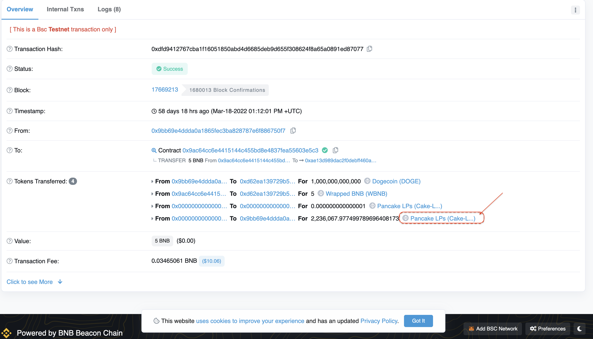
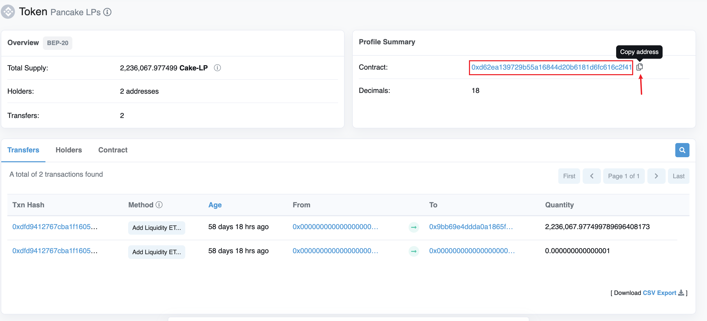
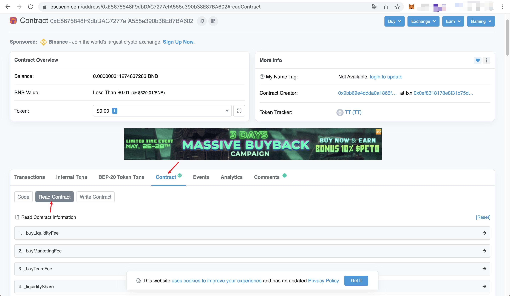
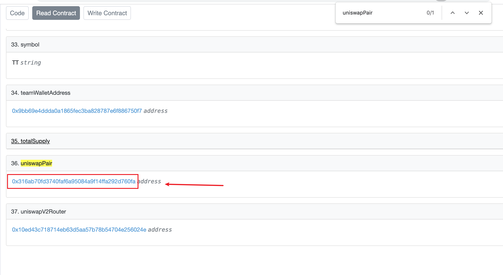
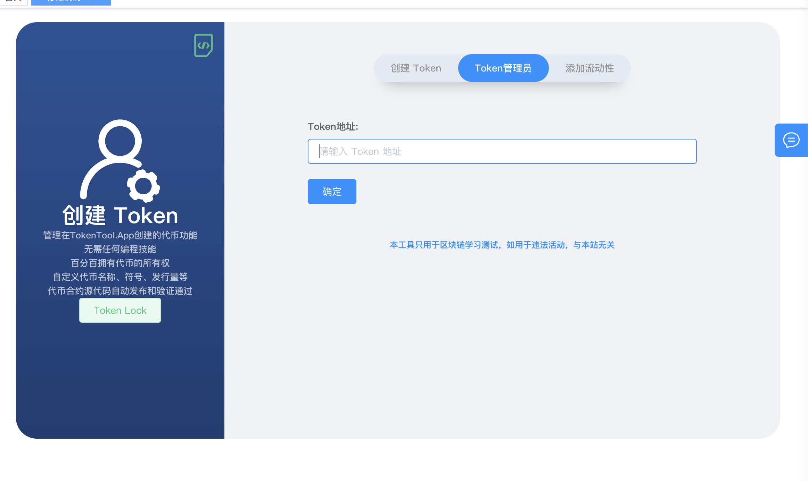
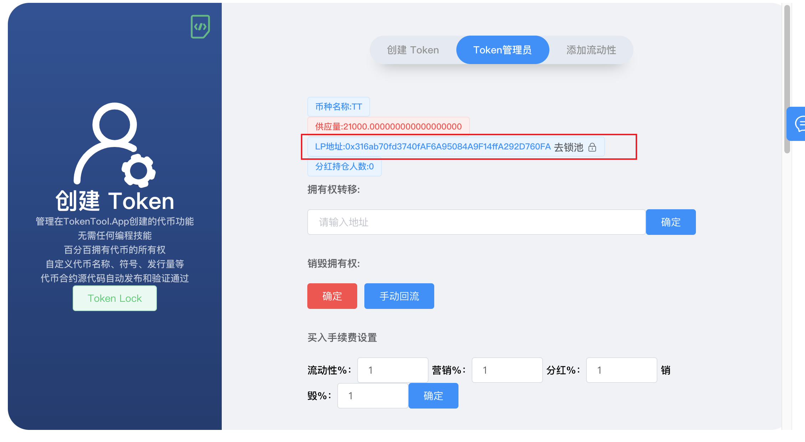

# 如何查找池子(LP)合约地址
如何查询自己的ERC20代币的池子(LP)的地址，我们添加流动性后，往往需要去锁池子，如何快速的通过一下方法查询到流动性池子的合约地址。

## 通过添加流动性记录查询
1. 通过区块链浏览器查询添加流动性交易记录

2. 例如  [https://testnet.bscscan.com/tx/0xdfd9412767cba1f16051850abd4d6685deb9d655f308624f8a65a0891ed87077](https://testnet.bscscan.com/tx/0xdfd9412767cba1f16051850abd4d6685deb9d655f308624f8a65a0891ed87077)

3. 例子中添加了5个BNB和1,000,000,000,000 个Doge代币，加入到Pancake交易所中。

4. 最终拿到了2,236,067.977....个LP 令牌余额。

5. 点击Pancake LPs 令牌合约地址。
6. 进入Pancake LPs 令牌合约明细页面（如下图）

7. 右上角红色部分地址就是LP的令牌合约地址

## 通过合约地址查询

1. 通过区块链浏览器输入合约地址查询，`Contract` 和 `Read Contract` 位置

2. 搜索查找 `uniswapPair` 关键字

提示：通过合约查询 uniswapPair 的字段地址默认获取的是BNB-XXX交易对的 LP地址
如果您添加的流动性不是BNB交易对，请使用第一种方式查询你的LP地址
## 通过Token管理员页面查询

1. 打开对应发币的页面，进入Token管理员（本方法适合未丢权限合约）
2. 输入合约地址进入管理员页面

3. 查看LP地址

提示：此方法查询的是 BNB-XXX交易对的 LP地址
如果您添加的流动性不是BNB交易对，请使用第一种方式查询你的LP地址