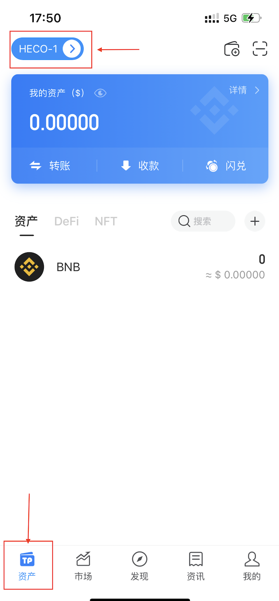
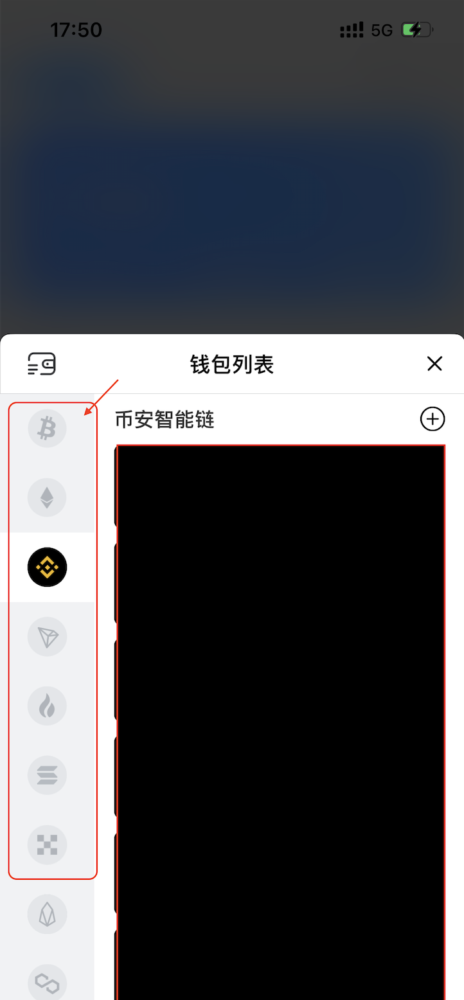
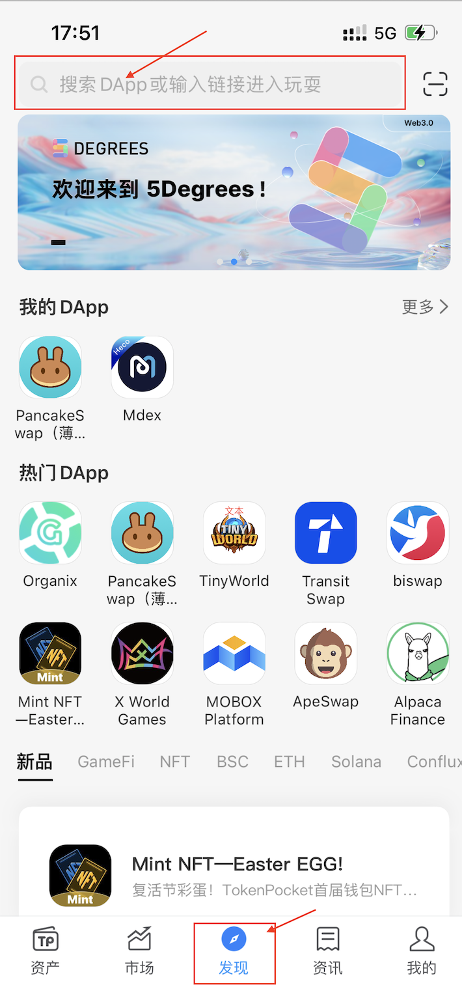
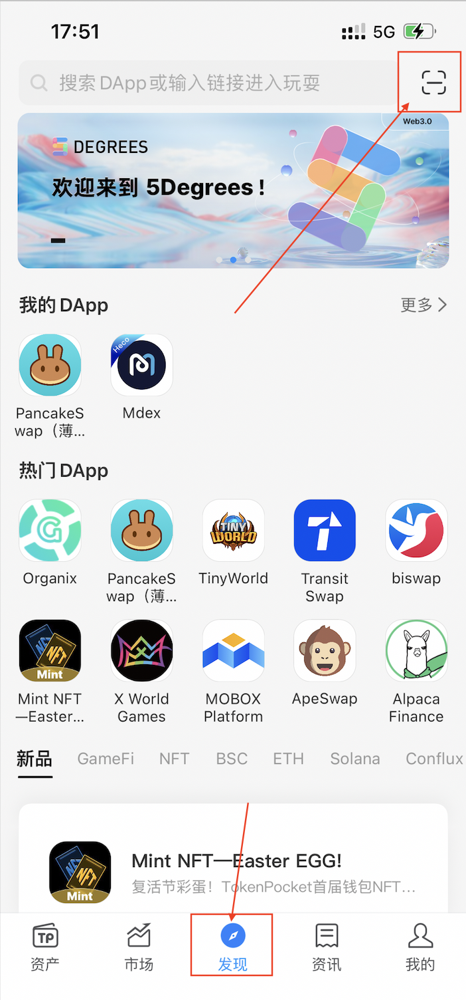
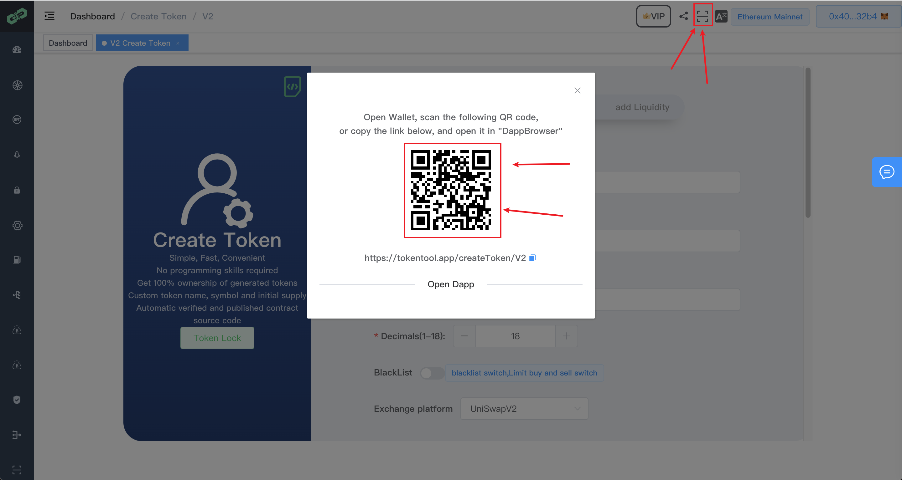

# 如何通过TP钱包发币

创建代币链接

[https://tokentool.app/createToken/eth](https://tokentool.app/createToken/eth) 一键发币带有黑名单/增发令牌

[https://tokentool.app/createToken/V2](https://tokentool.app/createToken/V2) 一键发币含手续费

[https://tokentool.app/createToken/V3](https://tokentool.app/createToken/V3) 一键发分红币

## 通过钱包APP操作步骤

1. 打开钱包APP，点击左小角**【资产】**页面，
2. 点击我的钱包，进行切换不同链（进入下图）

1. 左侧选择切换到不同链，如图切换到BSC链。

1. 点击**【发现】**菜单页
2. 点击搜索栏，输入发币链接地址
3. 也可以进行扫描二维码进入dapp 页面(如下图)

