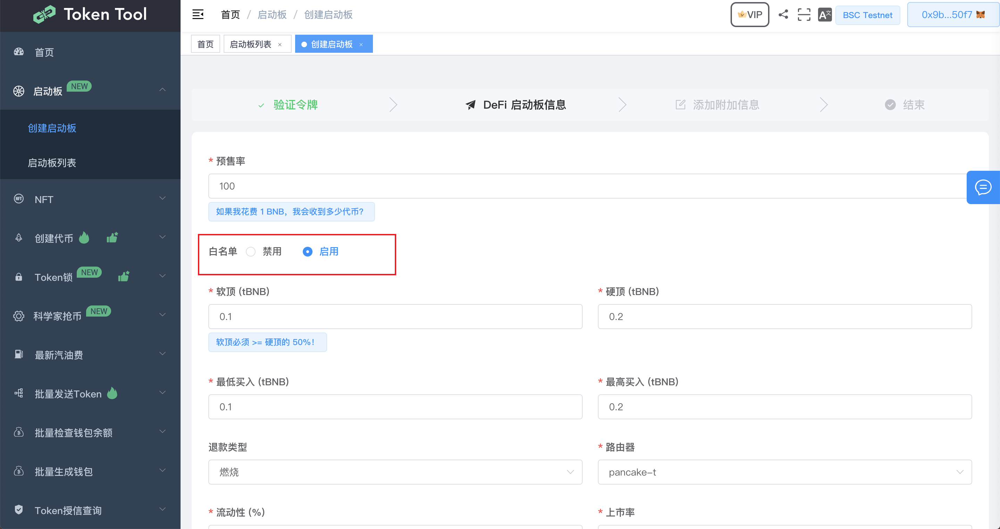
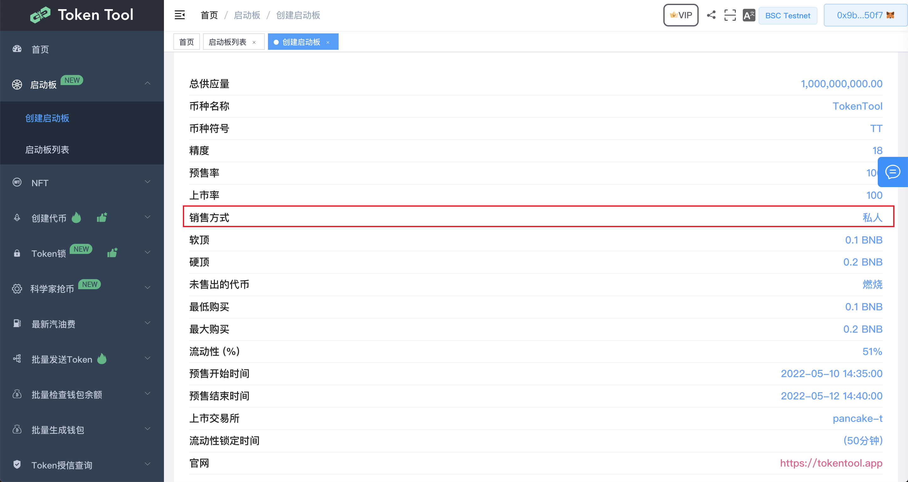
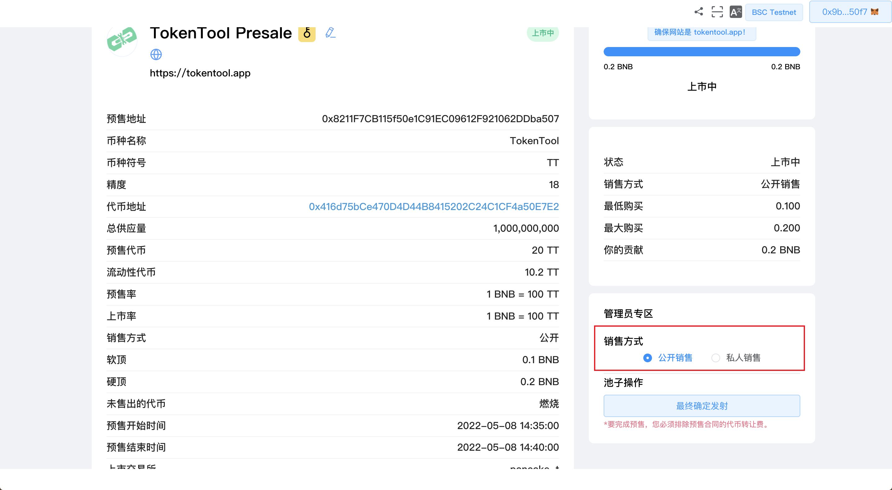
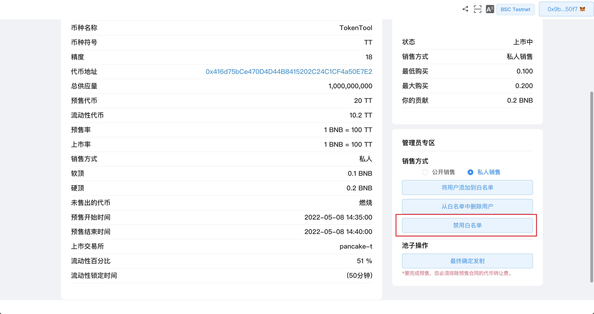
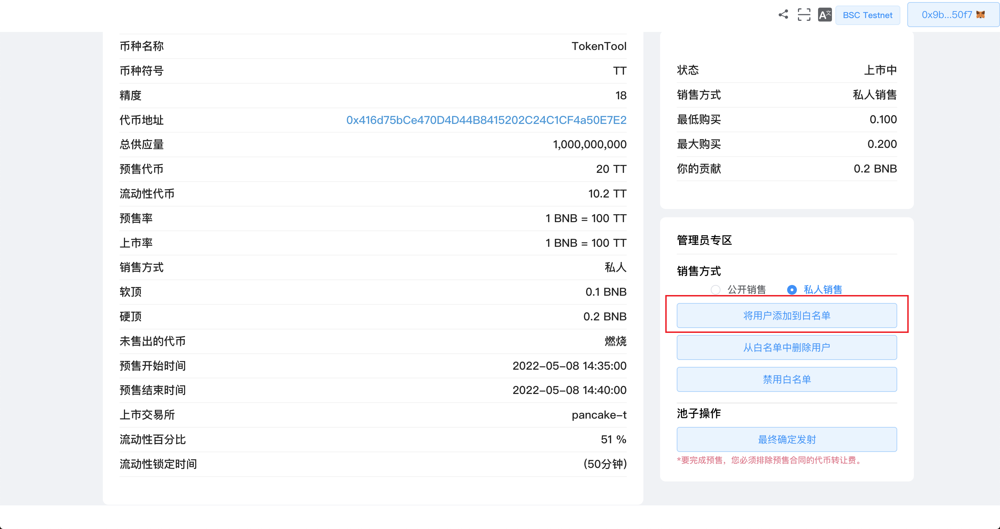
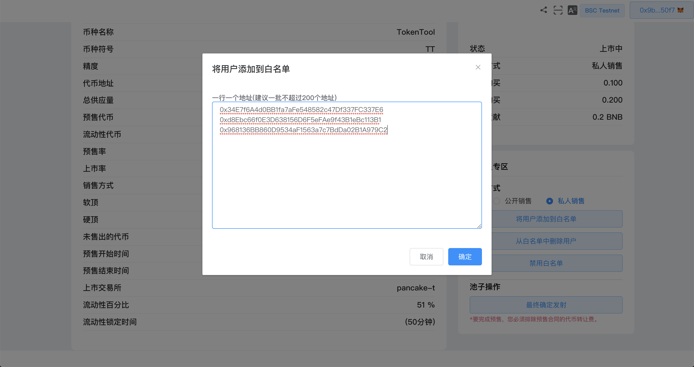
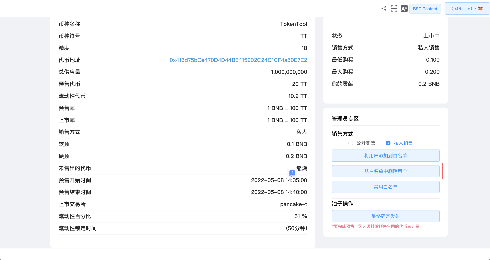

# 添加/删除白名单

TokenTool 上的白名单是管理员批准的地址列表，只有这些地址才能参与预售。拥有白名单的目的是保护预售免受机器人攻击并拥有真正的投资者。您可以在[创建 Launchpad](https://docs.tokentool.app/launchpads/create-a-launchpad)时或在预售开始前的任何时间启用/禁用白名单功能。

## 启动白名单

创建启动板时，在第 2 步 - DeFi Launchpad 信息中，您可以通过单击“白名单”部分中的“禁用”或“启用”来选择启用/禁用白名单：

提交启动板时，您可以看到“销售方式：私人模式”。

如果您在创建启动板时忘记启用白名单，您也可以在[更新启动板](https://docs.tokentool.app/launchpads/update-a-launchpad)时通过单击所有者区域中的“私人销售”按钮启用它。

MetaMask 现在将要求您确认交易。它还将向您显示您需要为该交易支付的费用。如果您同意，请单击“确认”按钮以完成该过程。

## 禁用白名单

如果您希望禁用白名单，您可以通过单击启动板所有者区域中的“禁用白名单”来实现。

MetaMask 现在将要求您确认交易。它还将向您显示您需要为该交易支付的费用。如果您同意，请单击“确认”按钮以完成该过程。

注意：您可以在预售期间“禁用白名单”以将销售变为公开销售，而不是列入白名单的预售。

## 如何添加白名单

您可以在预售之前甚至预售期间随时添加预售参与者的钱包地址。您可以通过单击启动板所有者区域中的“将用户添加到白名单”来执行此操作。

单击“将用户添加到白名单”后，您将看到一个弹出框。在这里，您可以将地址添加到白名单。地址用换行(一行一个地址)，没有逗号，下面的列表可以用作示例：

0x34E7f6A4d0BB1fa7aFe548582c47Df337FC337E6
0xd8Ebc66f0E3D638156D6F5eFAe9f43B1eBc113B1
0x968136BB860D9534aF1563a7c7BdDa02B1A979C2

输入完地址后点击“添加用户”，MetaMask 现在会要求您确认交易。它还将向您显示您需要为该交易支付的费用。如果您同意，请单击“确认”按钮以完成该过程。

注意：您每次最多可以将 400 个地址添加到您的白名单中。

## 如何删除白名单

您可以通过单击启动板所有者区域中的“将用户添加到白名单”来删除预售参与者的钱包地址。

单击“将用户添加到白名单”后，您将看到一个弹出框。在这里，您可以删除任何不需要的地址，但请记住，地址由新行分隔且没有逗号。例如：

0x34E7f6A4d0BB1fa7aFe548582c47Df337FC337E6
0xd8Ebc66f0E3D638156D6F5eFAe9f43B1eBc113B1
0x968136BB860D9534aF1563a7c7BdDa02B1A979C2

将上述地址粘贴到弹出框中，然后点击“确定”

MetaMask 现在将要求您确认交易。它还将向您显示您需要为该交易支付的费用。如果您同意，请单击“确认”按钮以完成该过程。
