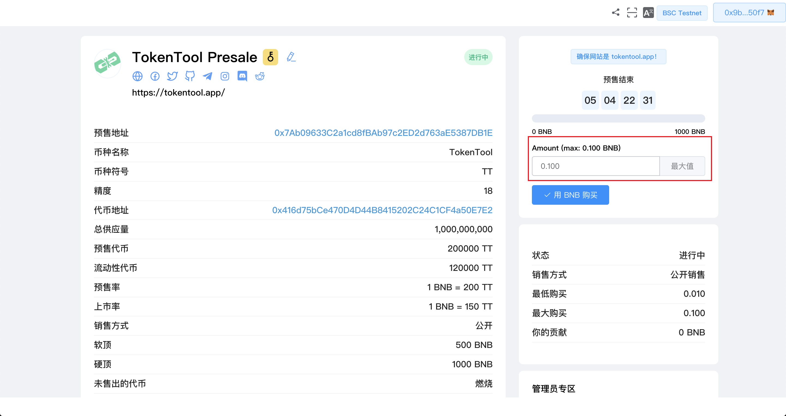
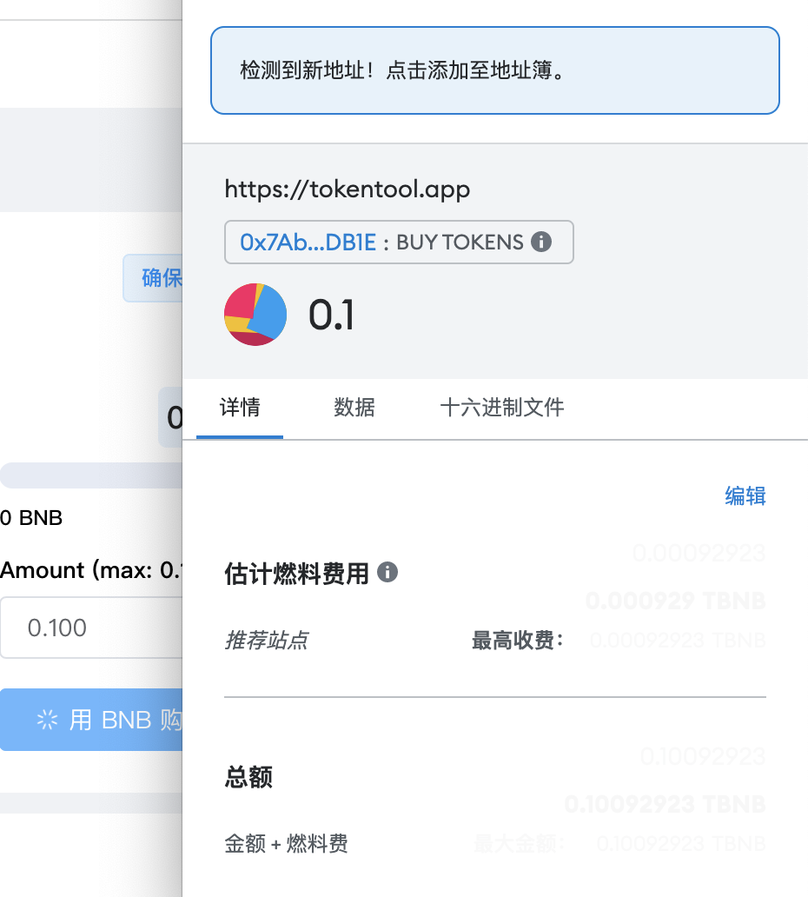
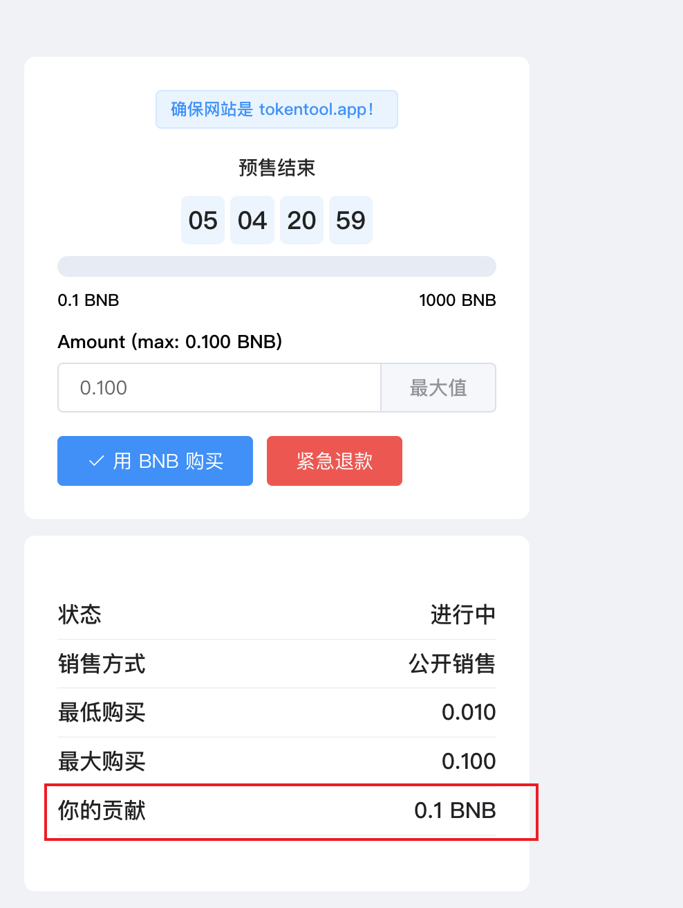

# 如何购买预售

如何参与 PinkSale 的预售

1. 转入到一下链接 [https://cointool.website/launchpad/list](https://cointool.website/launchpad/list) 所有的launchpad 列表页面
1. 有4种预售状态：准备中，进行中，上市中，关闭。您只需购买处于【进行中】状态的预售。例如，“TT”预售目前正在【进行中】。将鼠标悬停在它上面，然后单击“ViewPool”。
1. 点击“查看池”后，您可以看到与该预售相关的所有信息。您应该在购买前仔细检查所有内容。

4. 要购买预售，请在“数量”部分输入您要用于购买的 BNB（或 FTM、MATIC 或 ETH，具体取决于池）数量。相应的预售代币数量将自动计算在 BNB 数量之下。最后，点击“购买”按钮。

5. MetaMask 现在会要求您确认交易。它还将向您显示您需要为该交易支付的费用。如果您同意，请单击“确认”按钮以完成该过程。

6. 购买后，您会看到 你的贡献的BNB发生了变化，显示了您购买的BNB余额。

