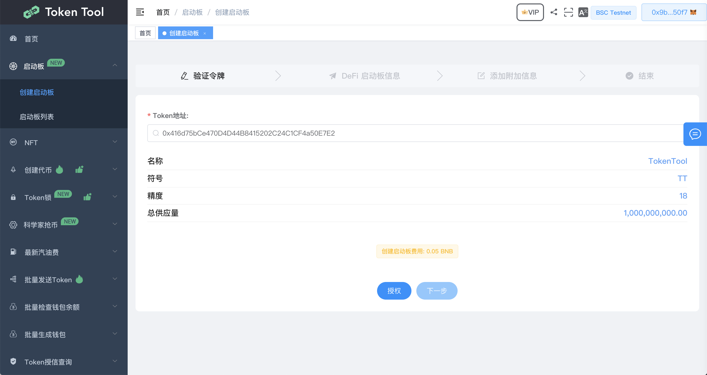
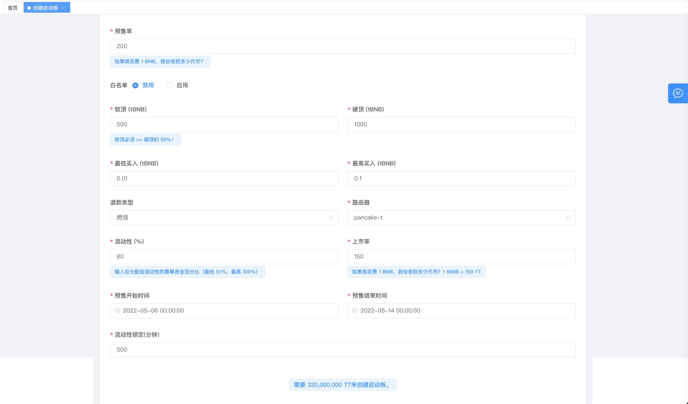
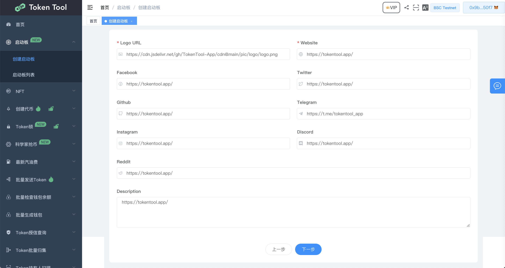
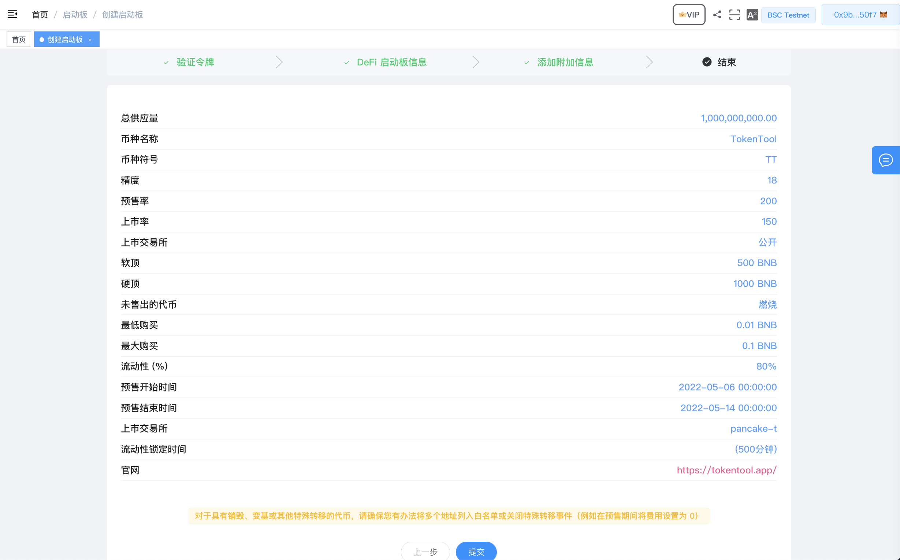
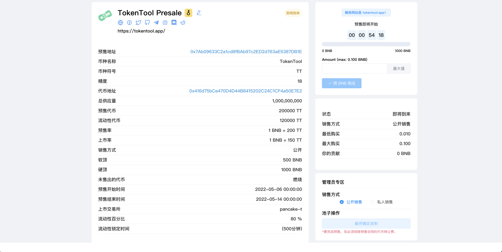

# 创建启动板

## 第1步：验证令牌
1. 链接你的钱包。
2. 前往[https://tokentool.app/launchpad/create](https://tokentool.app/launchpad/create)
3. 输入您的令牌地址(如果您已经有了)，如果没有可以通过[一键发币](https://tokentool.app/createToken/V2)创建您的令牌
4. 输入令牌后会显示代币信息，点击【授权】完成后，即可进入下一步骤

5. MetaMask 现在将会像你请求一次授权合约的操作，如果你同意点就“确认”按钮已完成该过程。

## 第2步：填写预售信息 

当你授权完成后，将会来到第二步骤，您需要输入您的筹集的Launchpad信息，以下是一些重要的参数信息：

1. 所有比例和数字信息必须使用正熟
2. 预售率表示私募者在预售阶段花费1个BNB能获取多少代币数量。
3. 白名单：如果你的预售是私人模式或者有预售贡献者的白名单，请选择“启用”。您可以在后续随时启动/禁用白名单
4. 软顶必须大于等于硬顶的百分之50%
5. 退款类型：如您在预售结束时为达到硬顶，多出的代币选择退款或销毁
6. 流动性（%），分配给Swap去中性化交易所的流动性百分比，最小值为51%，最大值为100%
7. 上市率，上市率时流动性资金池的初始费率（1 BNB = x 代币）。此价格通常低于预售价格，已运行在Swap交易所上获得更高的上市价格
8. 预售开始时间必须大于当前时间
9. 预售结束时间必须大于预售开始时间
10. 流动性锁定（分）：上市后，LP池子锁定时间，列如60分钟。

您可以检查创建预售池所需的总代币数量（显示在上一步/下一步按钮的上方）

下面这是一个例子：

分析例子数据，（当前预售数据）

1. 预售率为 （1BNB=200）数量，

2. 软顶：500，硬顶：1000。那么预售将需要 200 * 1000 = 200000个代币进行销售，
3. 最低买入0.01，最高买入0.1，说明一个地址最多只能买入0.1BNB，那么也对应将得到 20个代币数量
4. 退款类型 燃烧，如果预售结束，私募BNB 没有达到硬顶，但是达到了软顶500BNB，那么私募销售的200000个代币，将会100000个代币转入黑洞地址。
5. 路由器 将是要上市的去中心交易所，如BSC链的pancake-Swap
6. 流动性（%），分配给流动性私募资金百分之，您私募到的BNB，将需要分配百分之多少的比例，（如私募了1000个BNB，百分之80%，将会用800个BNB添加流动性，还剩下百分之20%，200BNB最终会返回到预售者地址中）
7. 上市率：上市率时流动性资金池的初始费率（1 BNB = 如图 150个代币）。
8. 最终添加流动性将需要（800 * 150代币 = 120000个代币 和 800个BNB去添加流动性）
9. 开始预售时间，私募者能够进行购买时间
10. 结束预售时间，结束时间时，您的私募费用必须达到最低的软顶标准，否则将是一次失败的预售。
11. 开盘后您的流动性锁定了500分钟
12. 最终您需要 120000代币添加流动性  和 200000个代币预售

## 第3步：添加附加信息

这一步有一些注意事项：

1. Logo URL 和网站地址为必填项，不能为空。没有这些，您将无法完成此步骤。

2. logo URL 必须已支持的图片扩展名结尾：png、jpg、jpeg、或者gif 。

   例如：https://ipfs.io/ipfs/Qma34oPEZzS5nEcKxzrdvpW6Th2gR2qxKayE18CFwNSJN6 

   如果您没有在线图片url 可使用 [TokenTool IPFS](https://tokentool.app/other/ipfs)文件系统上传图片到IPFS中

3. 输入完成后点击下一步。

下面一个例子：

## 第4步：完成

这是最后一个步骤，您可以在提交最后一次之前查看你所有的参数设置信息，确保一切正常后点击“提交”，或者您也可以返回上一步进行更改。

这谁一个例子：

点击“提交”后，MetaMask 现在会要求您确认交易。它还将向您显示您需要为该交易支付的费用。如果您同意，则单击“确认”按钮完成该过程，结果如下：

