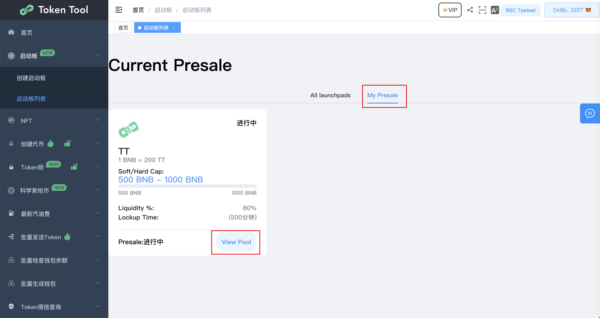
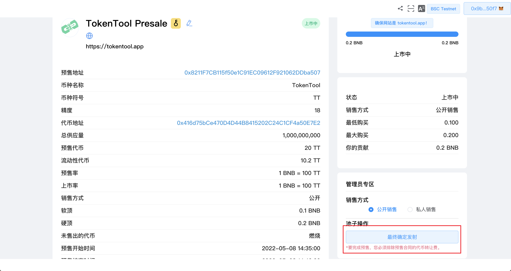

# 完成启动板

在您的预售达到软顶或硬顶的上限后，请按照以下步骤完成您的发射板

1. 前往[https://cointool.website/launchpad/list](https://cointool.website/launchpad/list)
2. 点击“我的启动板”，你就可以在这里看到你自己发布的所有预售项目
3. 点击ViewPool 查看预售详情信息

4. 在您的预售明细中，您可以看到“最终确认发射”按钮可点击状态。点击发射

5. 点击“最终确定发射”。MetaMask 现在将要求您确认交易。它还将向您显示您需要为该交易支付的费用。如果您同意，请单击“确认”按钮以完成该过程
