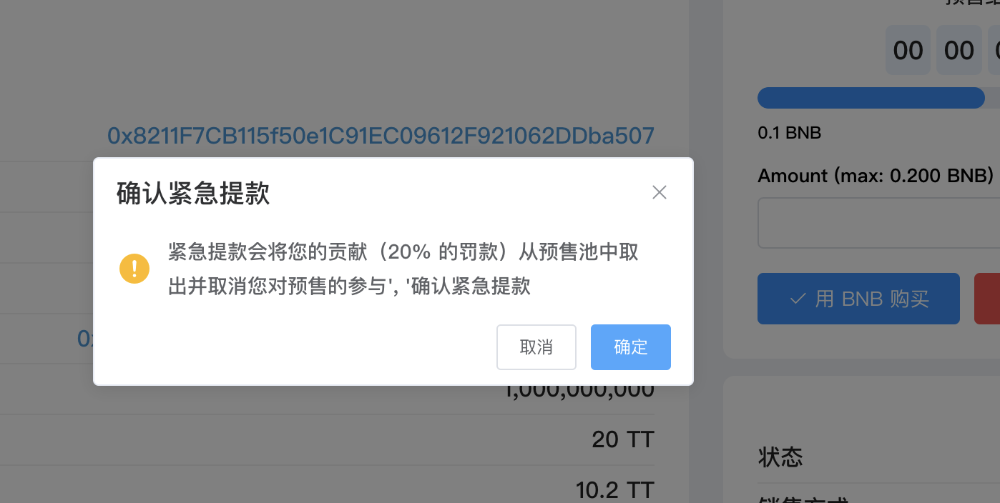
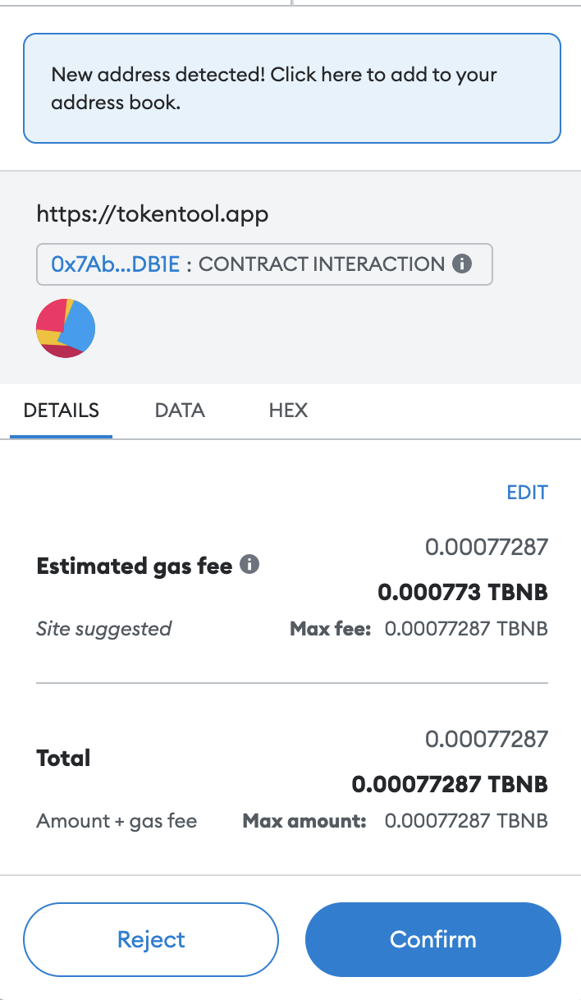

# 紧急撤离

参与并购买预售代币后，如果您改变主意并想撤回您的贡献，您可以使用“紧急提款”按钮，收取您贡献的 20% 的罚款。

1. 在预售发布页面，点击“紧急提款”按钮

2. 点击“确定”确认紧急提款流程

3. 点击“OK”后，MetaMask 会要求您确认交易。它还将向您显示您需要为该交易支付的费用。如果您同意，请单击“确认”按钮以完成该过程。

注意：

- 紧急提款会将您的捐款（20% 的罚款）从预售池中扣除

- 您可以随时使用“紧急提款”按钮，直到预售计时器结束前。

- 时间未到达结束预售或未到达硬顶，您都可以随时使用“紧急提款”按钮紧急提款。