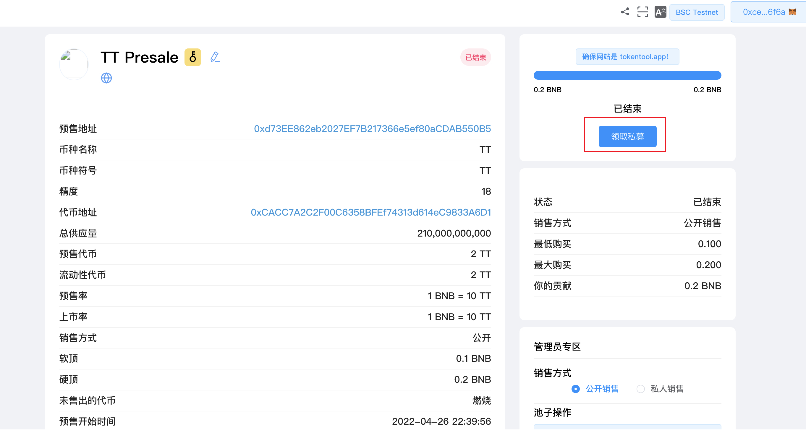

# 如何领取代币

在参与并购买预售代币后，接下来您将要领取您的代币。

如果已达到硬顶上限，或者软顶上限预售结束，并且项目方已经发射完成，您可以在“认领私募”按钮可用时认领您的代币。

MetaMask 现在将要求您确认交易。它还将向您显示您需要为该交易支付的费用。如果您同意，请单击“确认”按钮以完成该过程。

检查您的钱包余额以查看预售代币。我们建议您关注该项目的社交媒体渠道以查看他们的更新。