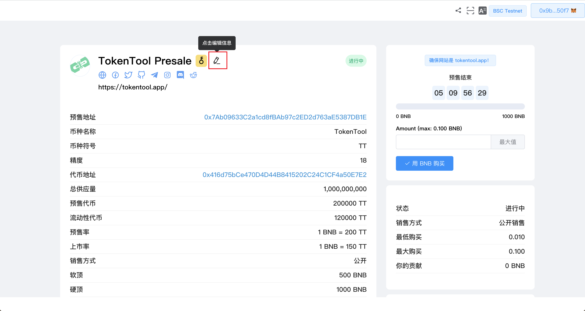
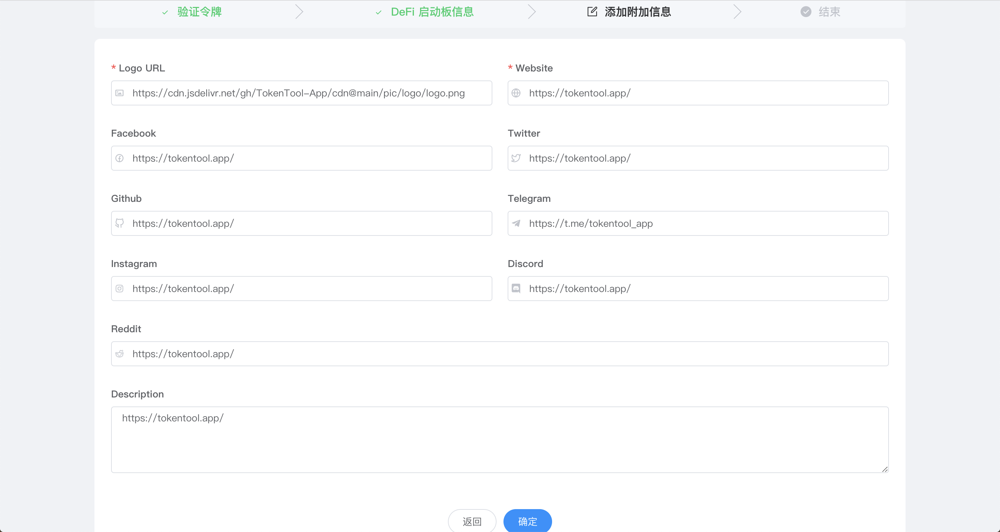

# 更新启动板

您可以通过以下步骤查看和更改有关 Launchpad 的一些基本信息：

1. 前往[https://tokentool.app/launchpad/list](https://tokentool.app/launchpad/list)
2. 点击“我的启动板”，你就可以在这里看到你自己发布的所有预售项目
3. 点击ViewPool 查看预售详情信息

4. 点击下方中图片方框的编辑按钮

5. 您可以编辑以下字段：Logo URL，(Website)官网地址，Facebook、Twitter、GitHub、telegram、Reddit、和launchpad描述信息。关于这些部分的一些重要说明：
	- logoURL必须支持图片扩展名结尾：png、jpg、jpeg或gif. 
	- logoURL 和 (Website)网站是必填字段，不能为空。

一个例子：

6. 编辑完成后点击“确定”。MetaMask 现在将要求您确认交易。它还将向您显示您需要为该交易支付的费用。如果您同意，请单击“确认”按钮以完成该过程