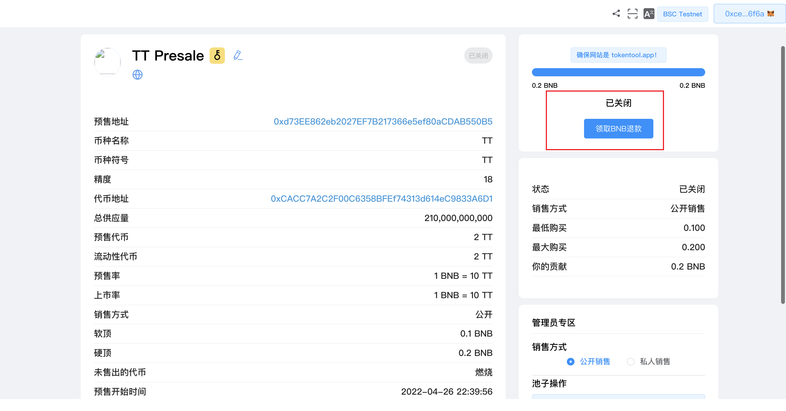
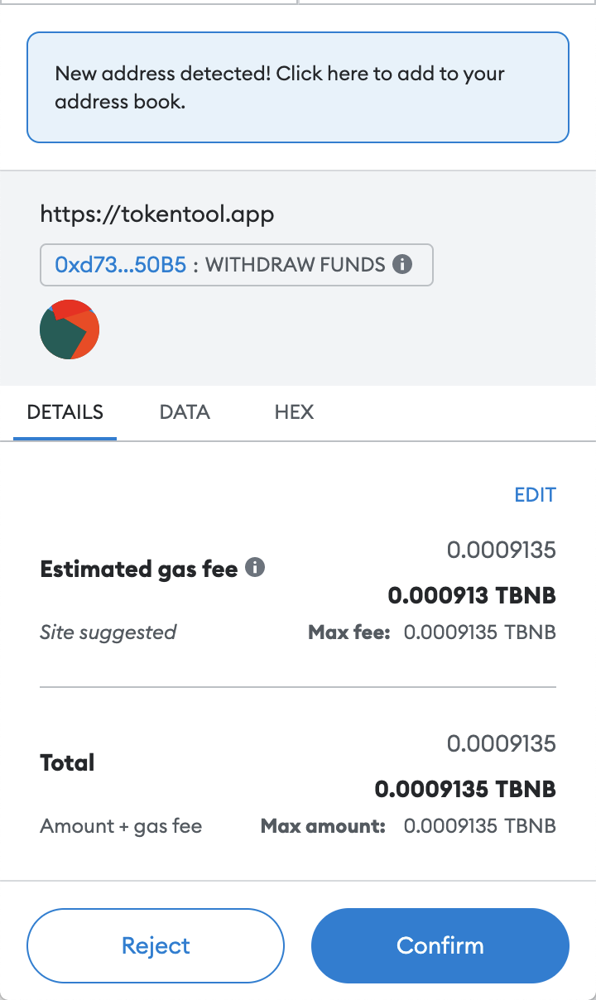
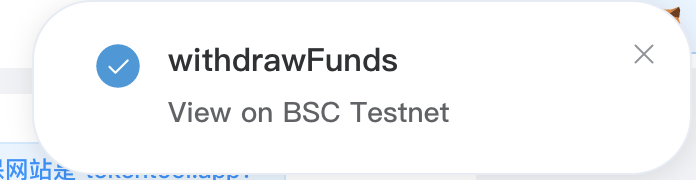

# 如何撤回您的捐款

参与并购买预售代币后，如果未达到软顶上限，您需要等到预售结束后才能撤回您的贡献。

在这种情况下，您可以通过点击“取款贡献”按钮提取您的贡献（BNB/ETH/KCC/AVAX）。

MetaMask 现在将要求您确认交易。它还将向您显示您需要为该交易支付的费用。如果您同意，请单击“确认”按钮以完成该过程。

您将在右上角看到一个弹出窗口，如下所示：

检查你钱包的余额，看看 BNB 是否回来了。

