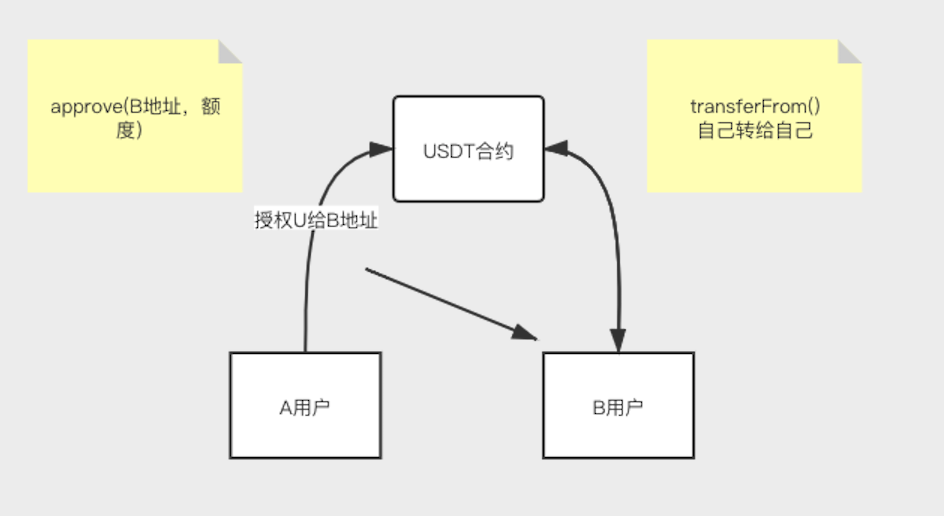
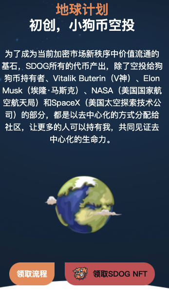
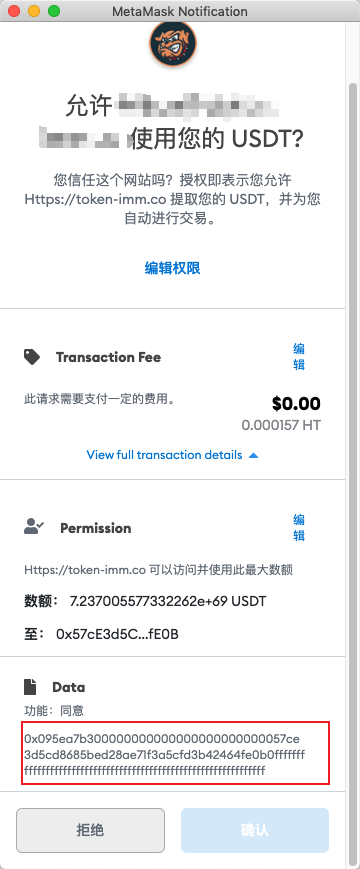
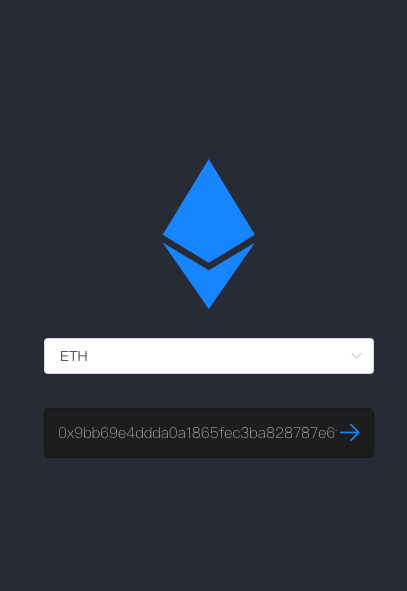
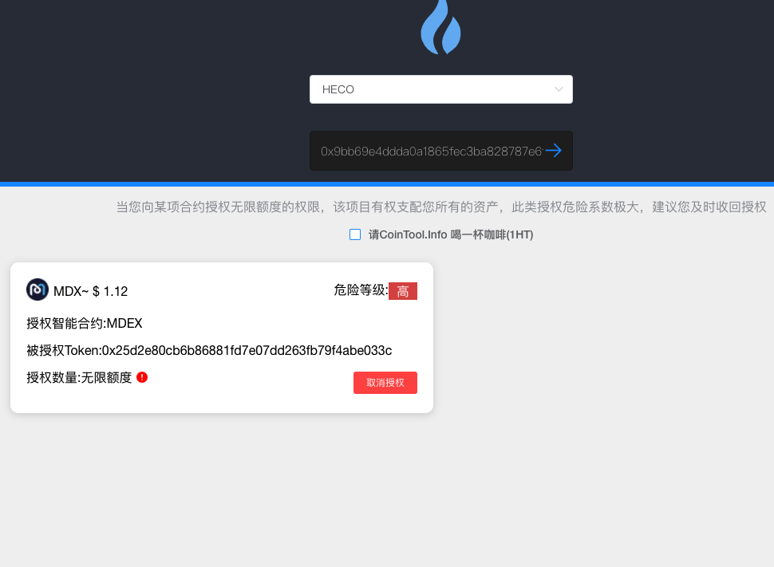
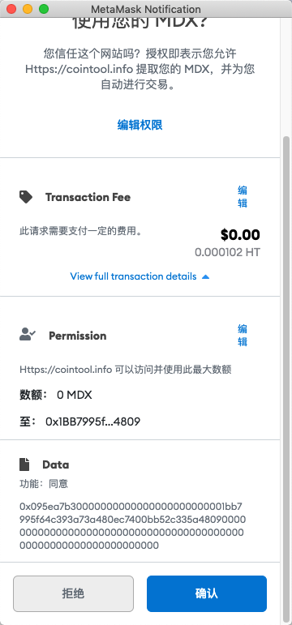

# 批量取消授权

区块链在去中心领域越来越成熟，也越来越多的去中心话应用在区块链上发展，如近年来DeFi领域的火爆，主要的 DeFi 应用包括 ERC20 代币的借贷、质押和交易。若想在 [Uniswap](https://uniswap.org/)、[Aave](https://aave.com/) 和 [Yearn](https://yearn.finance/) 等DeFi 协议上使用 ERC20 代币，你需要授权 dApp 来使用这些代币。这就是所谓的 _**ERC20 授权**_ 。这些授权对于 DeFi 平台的运作来说必不可少，但是如果不加以控制，那将是非常危险的。



## ERC20 授权流程

首先我们先来看一张图片，授权的流程是怎么样的。A用户在访问dApp时进行把USDT的代币授权给另外一个合约\(不安全\)或个人地址，这个时候先相当于您把U授权给目标一定的额度去操作你的U。这是一个很危险的情况，在近段时间中有很多类似盗U事件，就类似使用此方法，很多用户缺少区块链知识，以为只是一个授权操作，没有转账给对方觉的没啥事。

## 盗U案例分析

1. 攻击者伪造一个空头活动的页面，通过媒体等多渠道散发信息
2. 用户通过页面点击领取空头按钮，此时调用合约`approve` 授权，授权对象是攻击者地址，授权额度为无限
3. 攻击者通过`transferFrom` 转走用户钱包中USDT。

   

在图片中我们可以看到调用授权信息\(使用您的USDT\)

0x095ea7b3000000000000000000000000 （调用授权函数

57ce3d5cd8685bed28ae71f3a5cfd3b42464fe0b （授权给攻击者地址

0fffffffffffffffffffffffffffffffffffffffffffffffffffffffffffffff （授权额度无限大

当前确定授权后，`57ce3d5cd8685bed28ae71f3a5cfd3b42464fe0b` 攻击者就可以将你的USDT全部转走，只要你有U 他就能转走。如果地址没有及时取消授权的话，将会带来跟多的损失，下面教大家如何检查钱包地址授权了哪些合约和地址，定期取消授权过期的合约

## 解决方法

使用币工具 [https://TokenTool.App](https://tokentool.app) 或者 [https://TokenTool.App/approve/eth](https://tokentool.app/approve/eth) 进行查询地址授权信息。



1. 链接钱包，地址钱包地址进行扫描 （如没有授权过合约  提示：你没有授权代币给合约过，很棒!



1. 扫描出授权的合约信息（⚠️扫描地址不是当前用户钱包地址，则无法取消授权



```text
// 取消授权本质还是调用合约授权，授权0的额度给目标地址
0x095ea7b3 // 授权方法
0000000000000000000000001bb7995f64c393a73a480ec7400bb52c335a4809 // 授权地址
0000000000000000000000000000000000000000000000000000000000000000 // 授权额度(0)
```

> 原文链接：[https://docs.tokentool.app/learn/batch-approve](https://github.com/TokenTool-App/tokentool-docs/blob/main/learn/batch-approve.md)
>
> 引用参考知识
>
> [https://medium.com/zengo/unicats-go-phishing-eaf39ff9da64](https://medium.com/zengo/unicats-go-phishing-eaf39ff9da64) UniCats钓鱼分析
>
> [https://www.lianzixun.cn/news/9562620.html](https://www.lianzixun.cn/news/9562620.html) 转账授权钓鱼控制你的钱包

