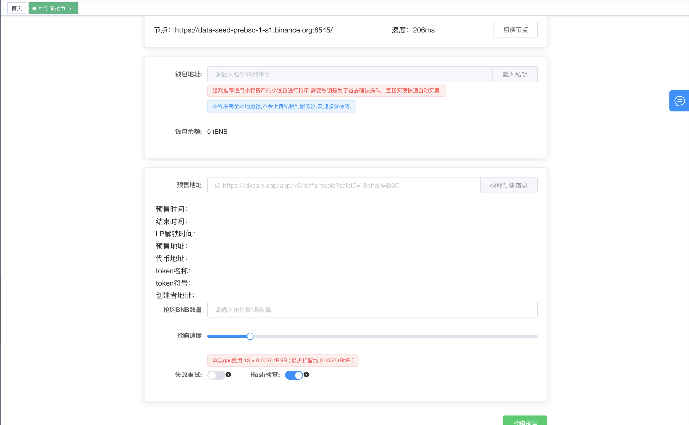
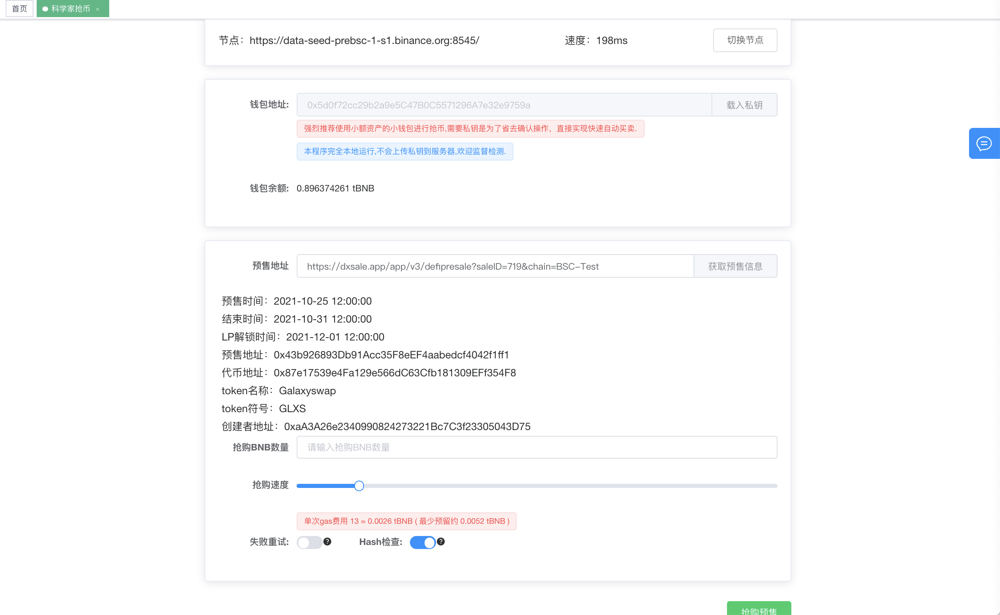
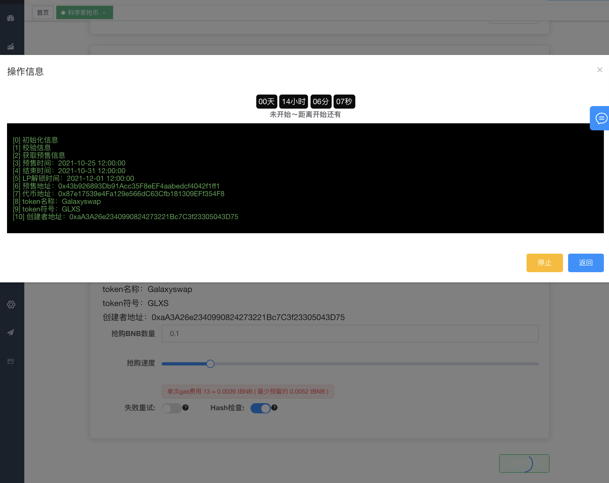
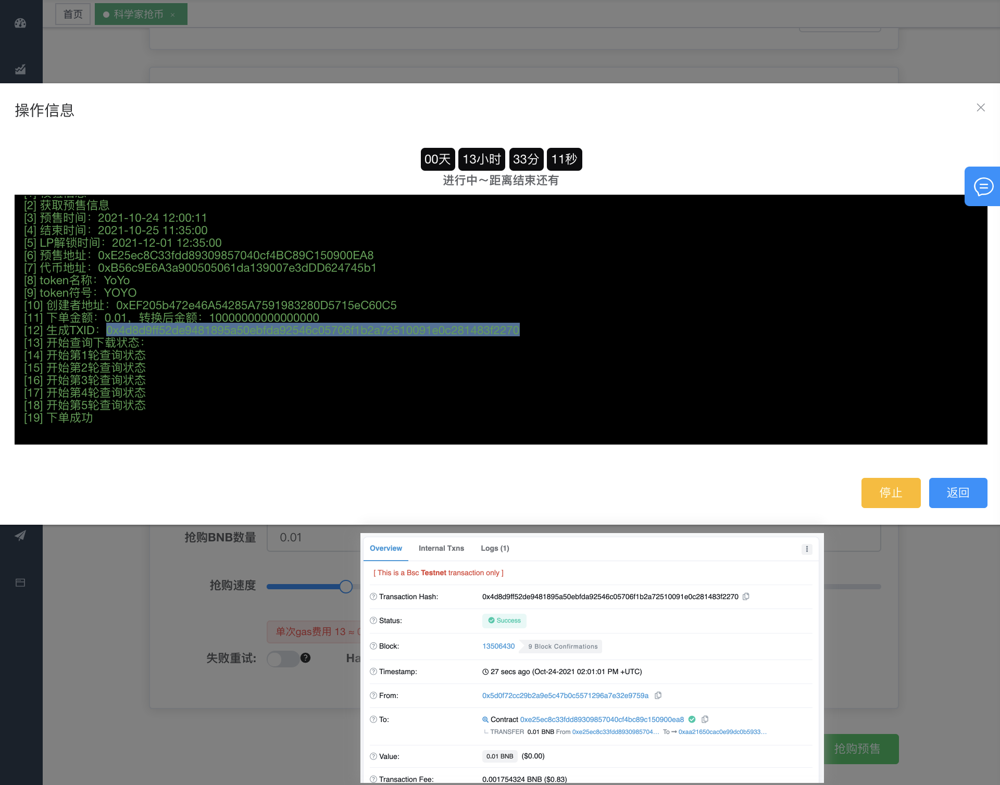

# 科学家抢DxSale预售教程

https://www.coinfu.website 是一款免费的区块链上的工具集合，今天教大家如何快速的抢购DxSale上面的预售代币。DxSale在此不在做多的介绍，如果他是干嘛的还不是很清楚的话，大家可以先去网上学习学习。

https://www.cointool.website/robotTrade/grabPreSale 一款免费的帮助小白抢DxSale的预售，如何才能快速的第一时间抢购DxSale预售币呢，那么就是在倒计时结束之后第一时间发起交易，通过你的bnb 发送到预售地址。

抢预售目前只支持DX平台的BSC链上面的项目，后续会增加其他链上的项目。本教程使用BSC-test网络演示。
抢预售拼的就是Gwei费用，gwei给得越高，抢到的速度越快，如果有十分看中的金狗，请勿吝啬gwei.

抢预售需要得到dx平台上面项目的地址 通常是在链接中，这个演示在BSC-test网络随便找了一个，查看一下信息是否正确。

提前核对确认一下预售的信息是否正确，以及最小/最大购买额度.如果有十分看中的金狗，可拉高一倍的抢购速度。

为了防止抢购失败，可以开启失败重试机制，失败重试机制会无限循环下单（会燃烧Gas手续费），如果失败了需要紧急通过区块链浏览器查看失败情况，或项目方群情况，是否是押金为存入等信息失败原因。

开启抢购，如果预售时间未到，则程序进入倒计时状态，时间达到会进行自动下单抢购。这里演示，我重新找一个已经开始预售的项目进行演示操作。如下图

抢购成功，有了抢购预售科学家，大家可以提前几分钟挂在电脑上进行自动下单操作。无需通过小狐狸操作，大大的提升的抢购的速度。本教程到处结束，如果有任何问题，可以通过首页的联系方式的反馈问题，或加入电报群.
