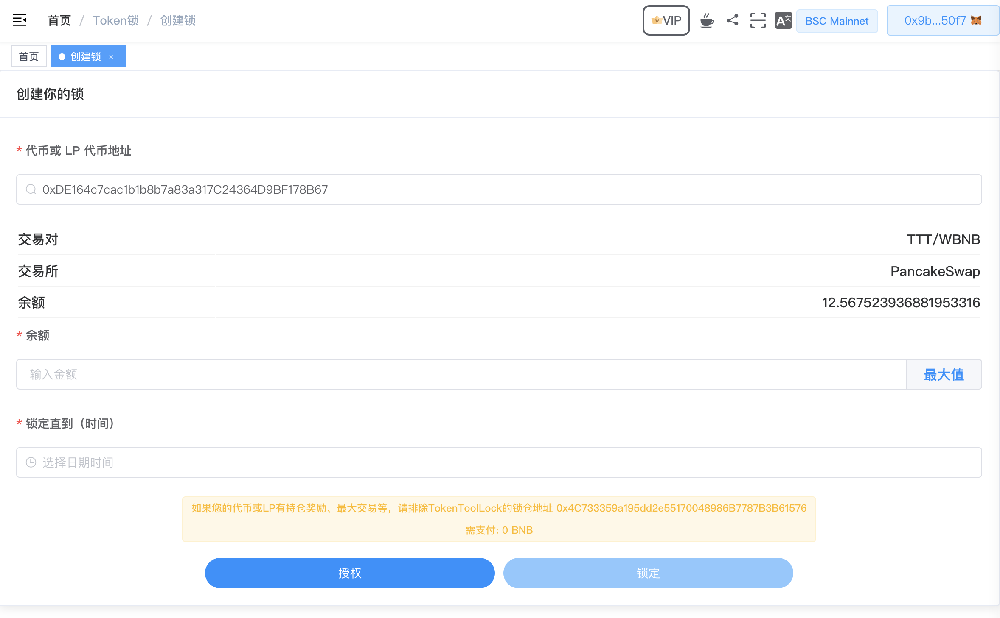
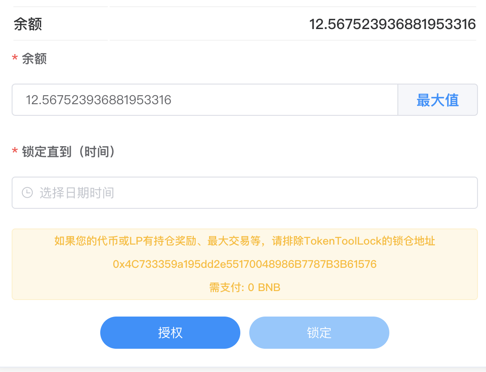
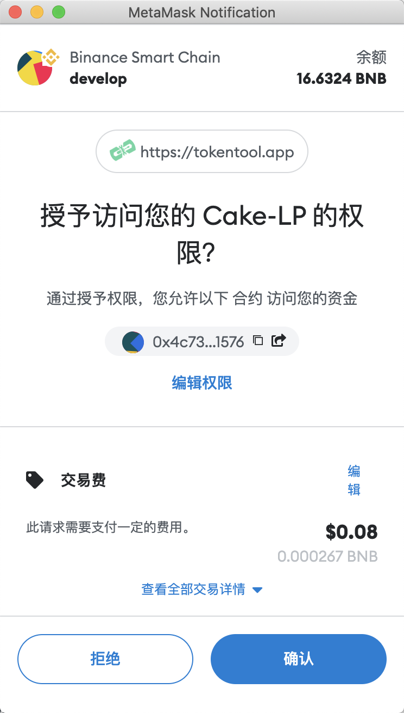
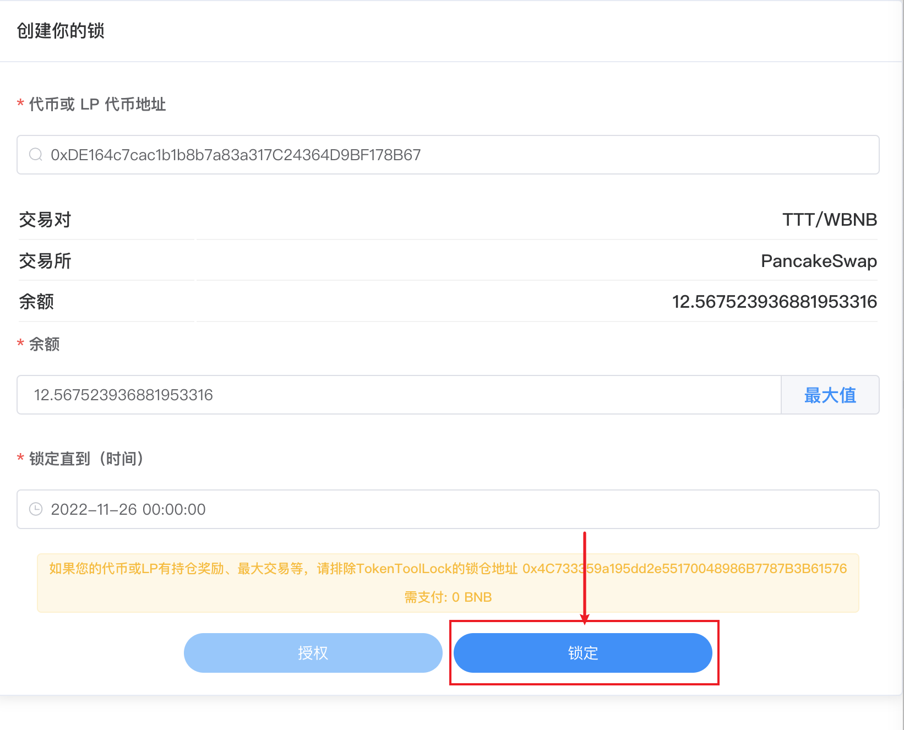
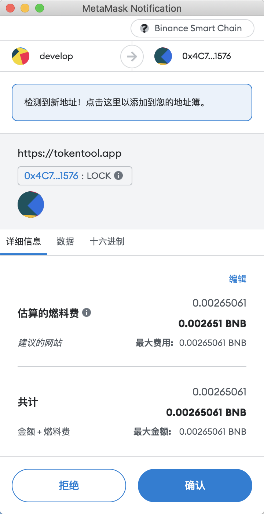

# 创建流动性锁池子

导航到 [https://tokentool.app/lock/create](https://tokentool.app/lock/create) 并按照以下步骤简单程序进行操作：

1. 链接你的钱包。
2. 前往[https://tokentool.app/lock/create](https://tokentool.app/lock/create)
3. 输入您的流动性令牌合约地址后，将会显示您的代币池子信息和余额（如图 TTT-WBNB交易对，交易所，余额等信息）。

4. 输入您要锁定的池子余额数量，并选择锁定直到某个时间点解锁的时间

5. 点击授权批准
5. MetaMask 现在会要求您确认交易。如果您同意，请单击“确认”按钮以完成该过程。
6. 完成授权后，点击锁定按钮，MetaMask 现在会要求您确认交易。

7. 点击"锁定"

8. MetaMask现在会要求您确认交易。它还将显示您需要为该交易支付的费用。如果您同意，则单击“确认”按钮已完成“锁定”过程。

注意点：

如果您的代币合约有LP分红，或者持LP奖励等机制，一定要有拆除的操作。

请排除TokenToolLock的锁仓合约地址，您可以在黄色提示中看到 TokenToolLock的锁仓合约地址。

