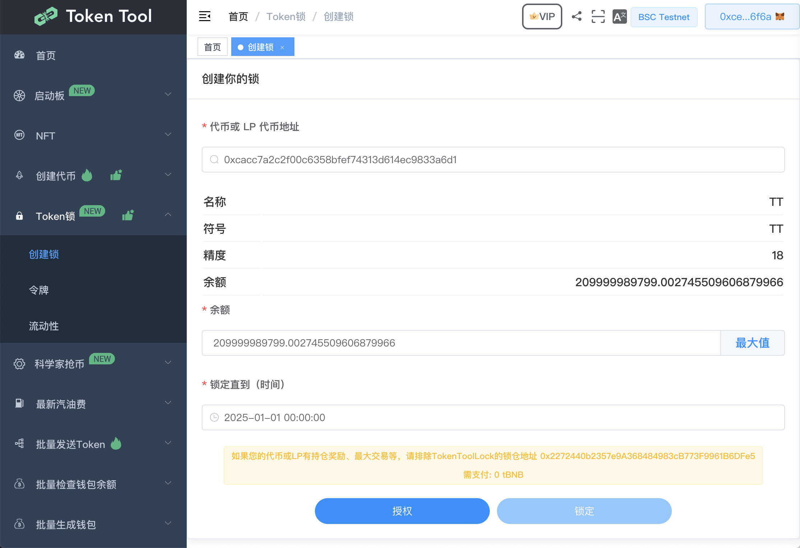

# 创建ERC20令牌锁

## 什么是令牌锁？

代币锁定允许 DeFi 项目设置自定义的代币锁定参数。

通过使用 TokenToolLocks 锁定团队成员的代币和国库，项目可以在他们的社区中灌输信任，并表明他们是长期参与的。在锁定到期之前无法释放时间锁定的代币，因此投资者可以确信团队不会在市场上倾销他们的所有代币（又名“退出骗局”）。

## 为什么令牌锁很重要？

*项目可以将一定比例的预挖代币供应或团队拥有的代币锁定到我们的时间锁定的去中心化智能合约保险库中。*

在锁定期结束之前，项目无法访问代币。这样社区和投资者就可以放心，代币在合同期内不会被团队大量抛售，即所谓的退出骗局。

与大多数代币发行相比，这是一项巨大的创新，在大多数代币发行中，项目可能会避免履行其承诺并恶意出售其所有代币，从而使持有者、质押者和投资者的代币价格接近 0 美元。

## 如何创建我的令牌锁?

导航到 [https://tokentool.app/lock/create](https://tokentool.app/lock/create) 并按照以下步骤简单程序进行操作：

1. 链接你的钱包。
2. 前往[https://tokentool.app/lock/create](https://tokentool.app/lock/create)
3. 输入您的令牌合约地址后，将会显示您的代币信息与代币余额。
4. 输入您要锁定的令牌代币余额数量，并选择锁定直到某个时间点解锁代币时间

如下例子：将所有代币余额锁定直到 2025-01-01 00:00:00 时间点解锁。

5. 点击授权， MetaMask 现在会要求您确认交易。如果您同意，请单击“确认”按钮以完成该过程。
6. 完成授权后，点击锁定按钮，MetaMask 现在会要求您确认交易。

注意点：

如果您的代币合约有持币分红，或者持币奖励，转账限额等机制，一定要有拆除限制的操作。

请排除TokenToolLock的锁仓合约地址。

