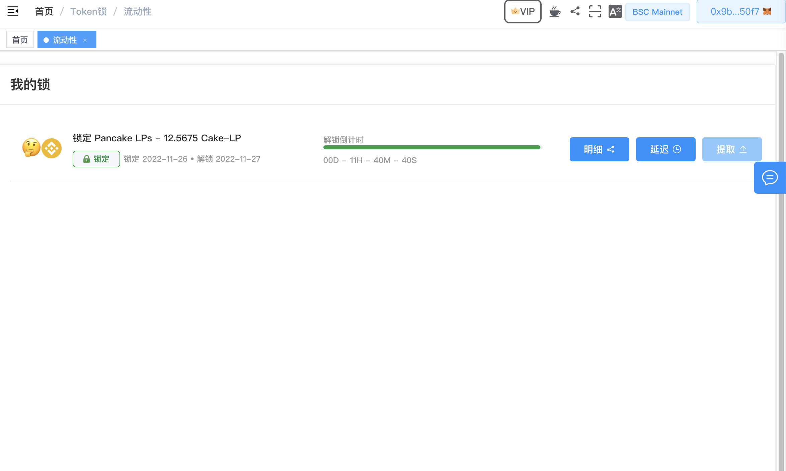
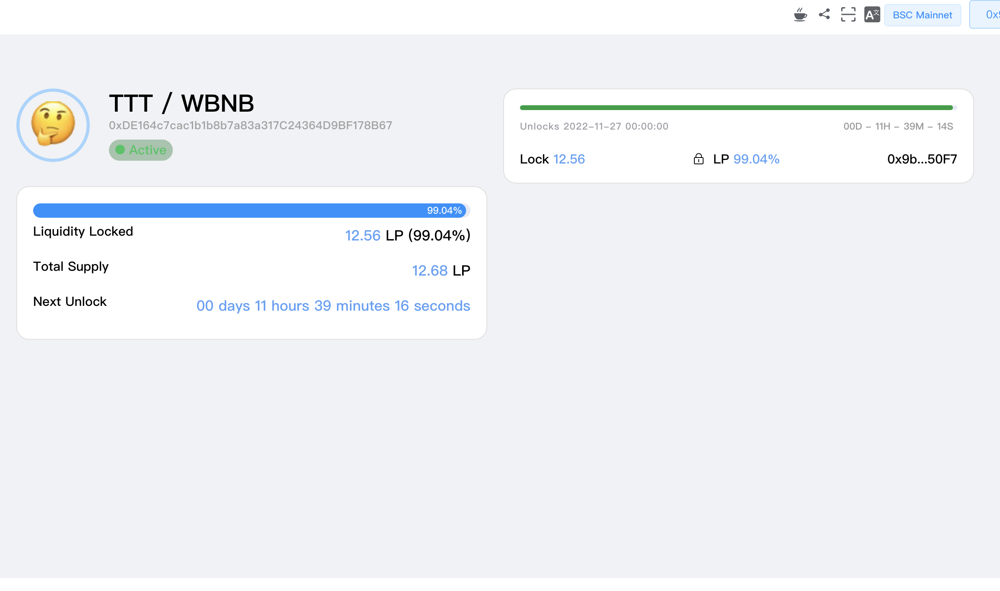
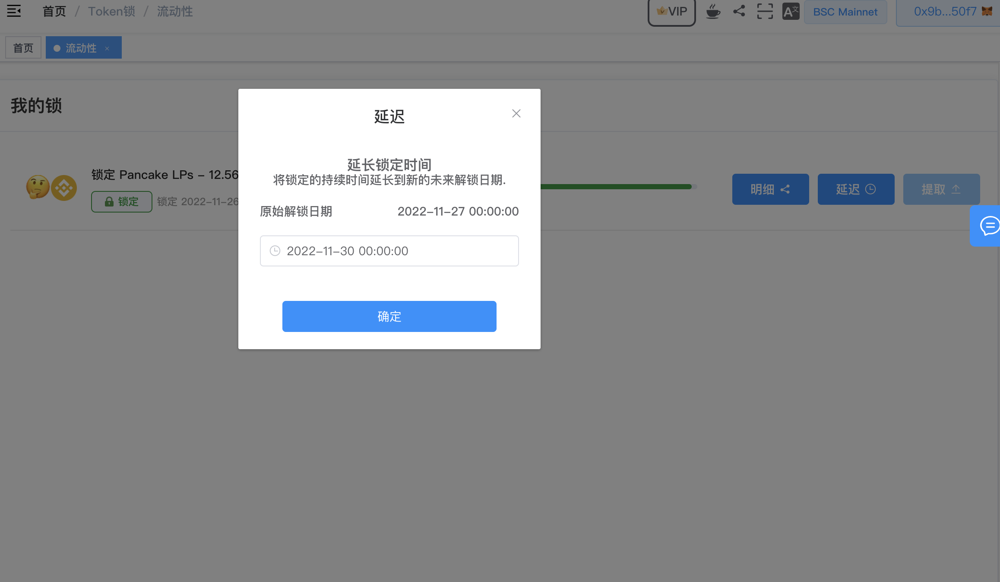
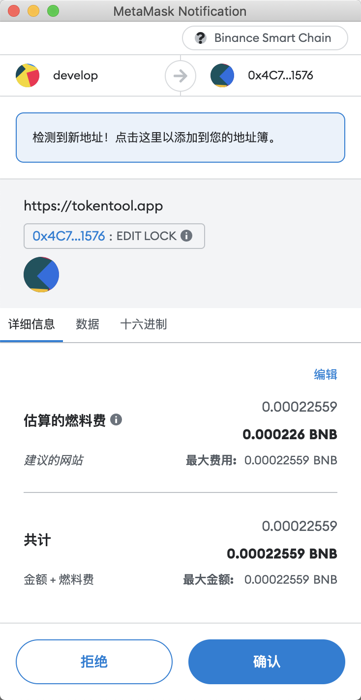
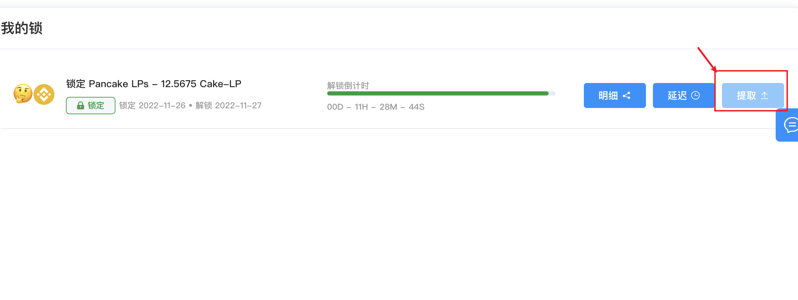

# 解锁LP池子/代币

教学视频：添加流动性，锁池子、解锁等操作 [https://youtu.be/Dqb9qL22YwU](https://youtu.be/Dqb9qL22YwU)

导航到 [https://cointool.website/lock/liquidity](https://cointool.website/lock/liquidity) 并按照以下步骤简单程序进行操作：

1. 链接你的钱包。
2. 前往[https://cointool.website/lock/liquidity](https://cointool.website/lock/liquidity)
3. 查看当前地址锁池子列表数据，可以看到（锁定时间于解锁时间，明细信息，延迟解锁操作等）

查看明细信息，可以看到很多解锁的明细数据，如分配是否代币可能会存在多次解锁代币。

##### 延迟操作

1. 通过延迟操作，可以延长代币或池子的解锁时间，**tips：时间只能往后推，不可提前解锁**

2. 点击"确认"
3. MetaMask现在会要求您确认交易。它还将显示您需要为该交易支付的费用。如果您同意，则单击“确认”按钮已完成“延迟时间”过程。

##### 解锁操作

1. 如时间已经到达设置的解锁时间后可以通过提取按钮，提取代币或池子LP
2. 点击提取
3. MetaMask现在会要求您确认交易。它还将显示您需要为该交易支付的费用。如果您同意，则单击“确认”按钮已完成“提取解锁”过程。

