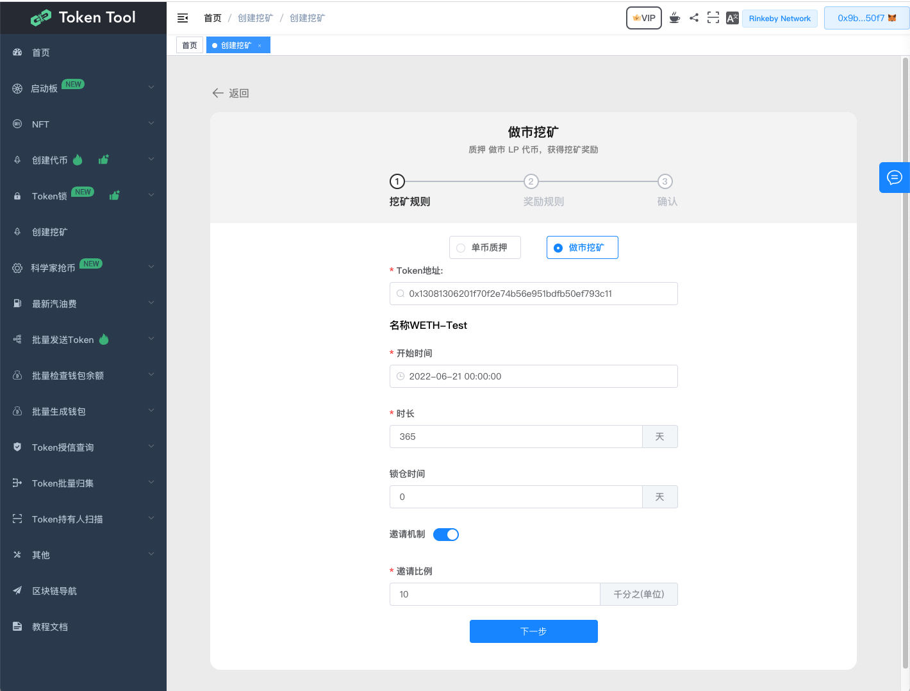
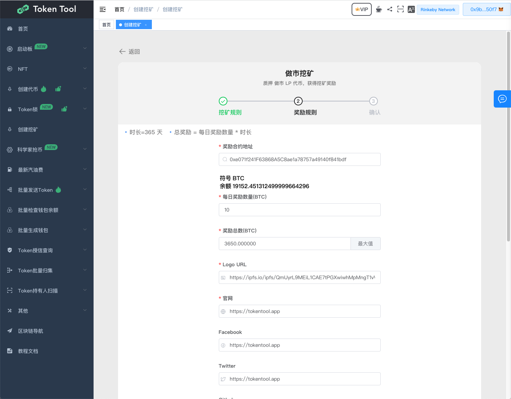
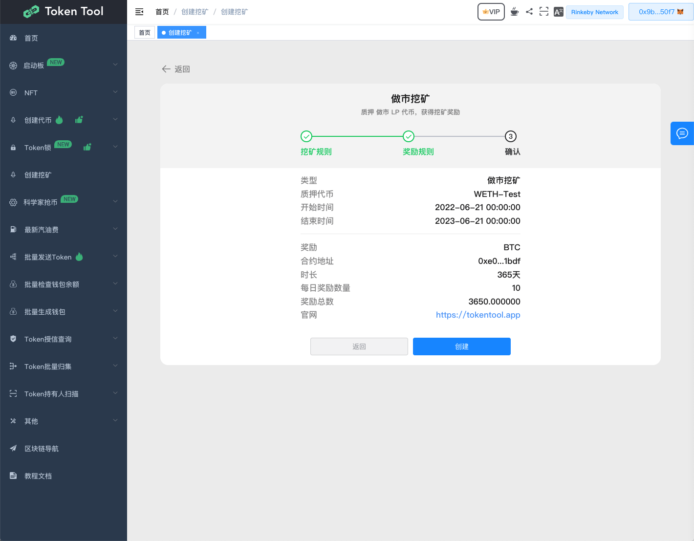
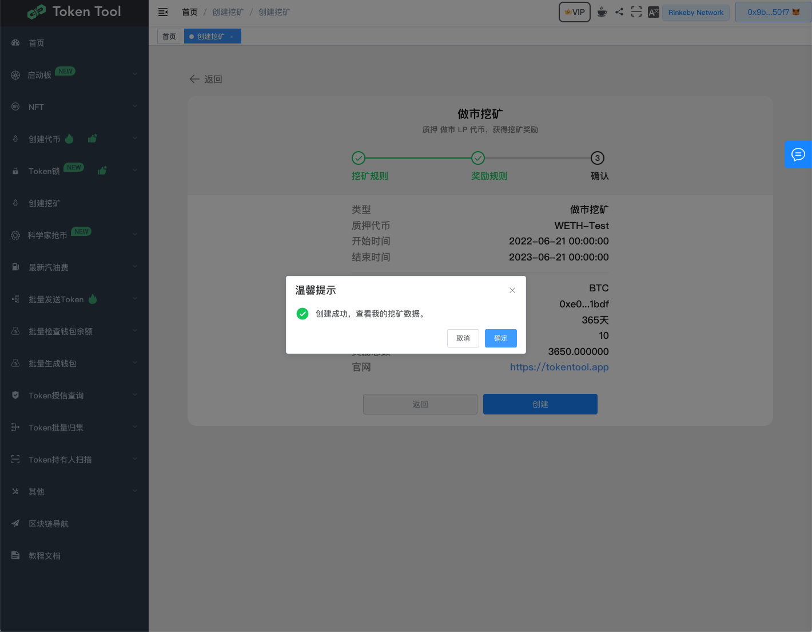

# 创建挖矿
如何使用TokenTool 创建挖矿活动
[https://youtu.be/QfqfRCVvPc8](https://youtu.be/QfqfRCVvPc8)

## 第1步：挖矿规则

1. 链接你的钱包。
2. 前往[https://tokentool.app/mining/list](https://tokentool.app/mining/list) 创建挖矿页面。
3. 点击创建挖矿

#### **1.1选择挖矿类型**
TokenTool提供以下两种不同的挖矿类型，这两种类型都不支持通缩类型的代币(通缩类型根据币的价格自动放大或缩少供应量)，挖矿池子一旦创建，参数无法修改。

- **单币质押挖矿**：鼓励用户锁仓代币，减少流通代币；创建后，用户只需要质押一种代币，就可以获取挖矿收益；
- **双币做市挖矿**：激励用户为项目代币做市，提高代币在链上的流动性；创建后，用户需要先在流动性资金池中质押两种代币做市，获得LP，之后在挖矿池中质押LP获取挖矿奖励。
#### **1.2设置挖矿池参数**
1. Token地址：用户质押的合约地址。如果是**双币做市挖矿**则是LP池子地址。
2. 开始时间：选择开始挖矿的时间，必须大于当前时间
3. 时长：挖矿总天数，（整数单位）。
4. 锁仓时间：用户质押余额锁定时间，须到期时间后才可取出。
5. 邀请机制：是否开启邀请机制。
6. 邀请比例：用户邀请下级代理后，奖励佣金比例。千分之单位，如（100，则是千分之100，假设A用户收益奖励1000个代币，则会将100个比转给邀请人）。

## 第2步：奖励规则

1. 输入奖励合约地址，用户奖励质押给用户者。
1. 输入每日奖励数量、奖励总数：参与挖矿用户的奖励是按照参与的资金比例，瓜分挖矿奖励。
1. Logo、官网等扩展信息。

## 第3步：确认完成

最后确认信息无误后**【授权】**和**【创建】**二步骤，点击“提交”后，MetaMask 现在会要求您确认交易。它还将向您显示您需要为该交易支付的费用。如果您同意，则单击“确认”按钮完成该过程，结果如下：

