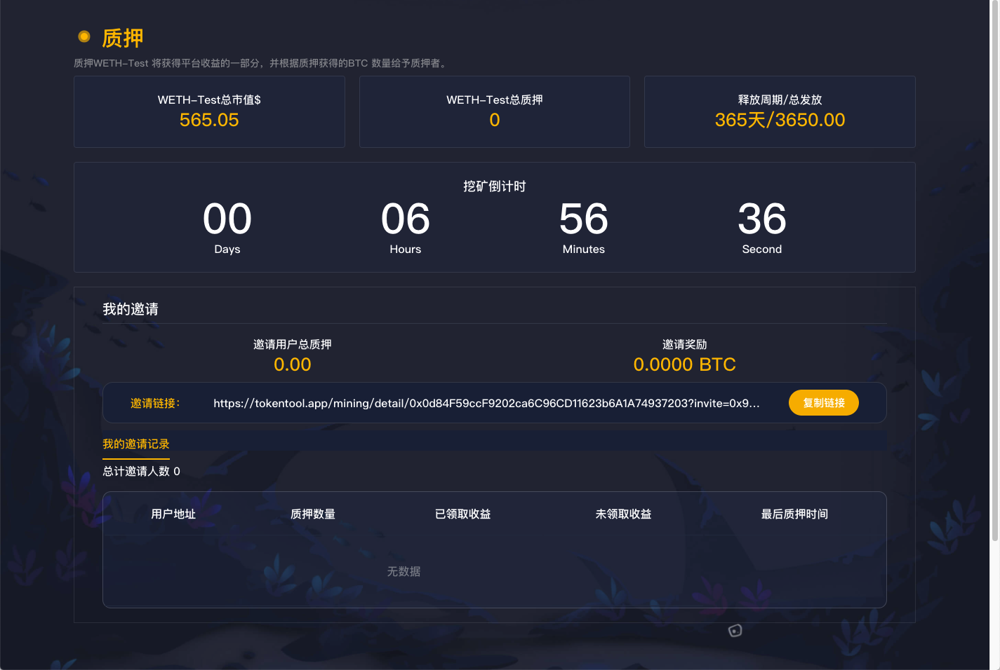
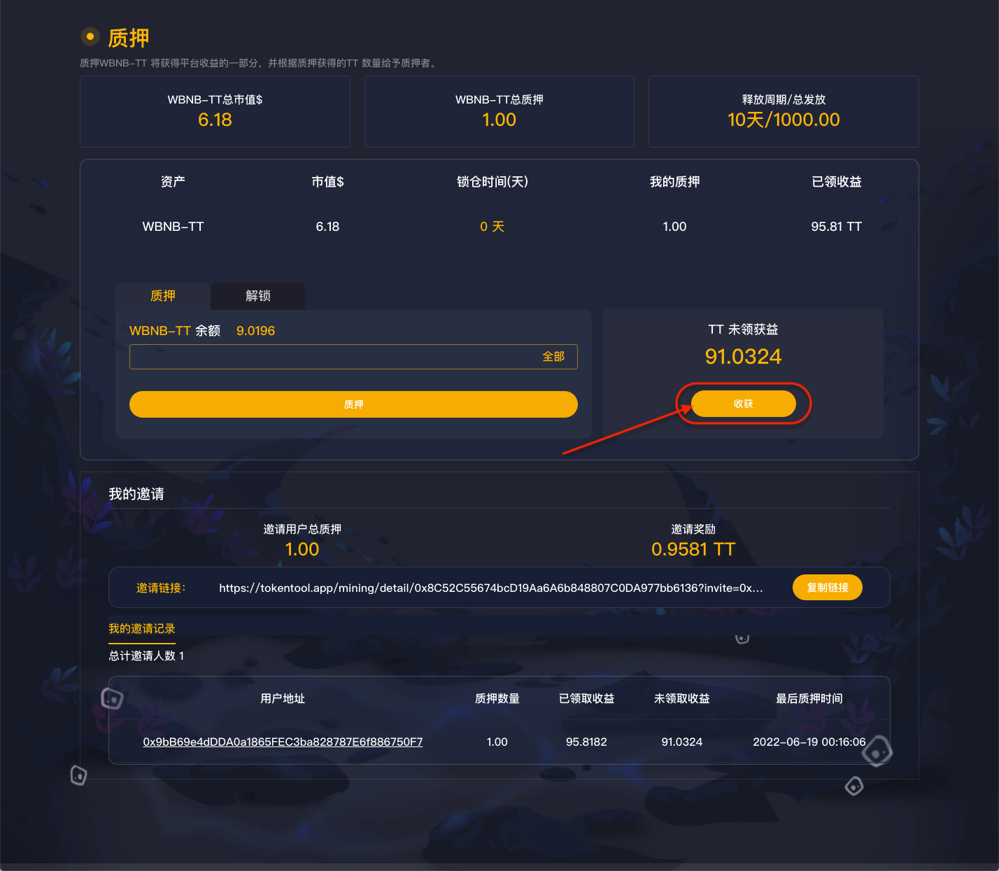

# 质押挖矿

## 质押挖矿介绍

1. 总市值：双币做市挖矿将会自动计算LP池子的USDT价值，（只有LP双币挖矿才会有市值）
2. 总质押：当前质押挖矿池中总的质押数量。
3. 释放周期/总发放：挖矿总天数和总的发放数量，如要计算每天发送量（总天数/总发放=每日发放量）
4. 如挖矿未开始，则会进行倒计时中，等待挖矿开始，即质押挖矿。
5. 邀请记录：用户通过您的邀请记录，质押挖矿那么将会显示下级代理的信息。以及邀请奖励信息。

## 质押

1. 小狐狸/TP钱包dapp打开质押挖矿链接，链接钱包
2. 根据质押的余额，选择全部或部分余额质押挖矿。
3. 如有质押锁仓时间，需确认是否质押。

## 领取收益

1. 小狐狸/TP钱包dapp打开质押挖矿链接，链接钱包
2. 查看收益，点击领取
3. 收益产生规则：根据每天发放的数量，计算每秒钟的收益，根据质押占比，将会得到收益比例。例如（10天，发放1000个TT代币，每日发放 1000 / 10 = 100个TT，当前质押占比百分之100%，那么当前用户每天能获取100个TT代币，100 / 86400秒 = 每秒钟 可获得 0.001157407407）