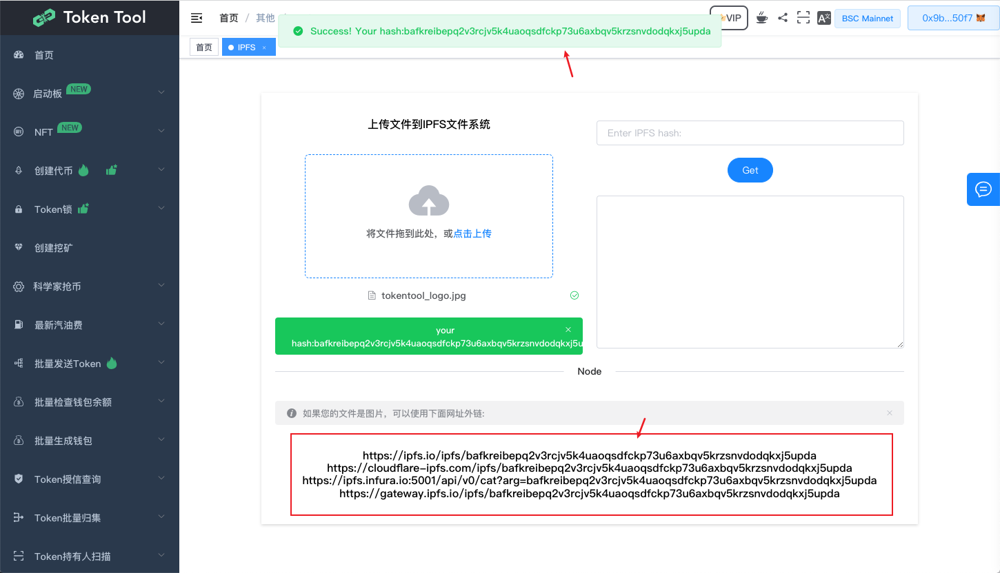

# IPFS

IPFS 为分布式 Web 提供动力，一种点对点超媒体协议，旨在通过使网络可升级、有弹性和更开放来保存和增长人类的知识

## 如果将本地图片上传到IPFS网络中

### 前往[https://cointool.website/other/ipfs](https://cointool.website/other/ipfs) IPFS图片上传页面

### 点击上传按钮，选择本地文件/图片进行上传。

### 上次完成后，获取hash值和地址信息

