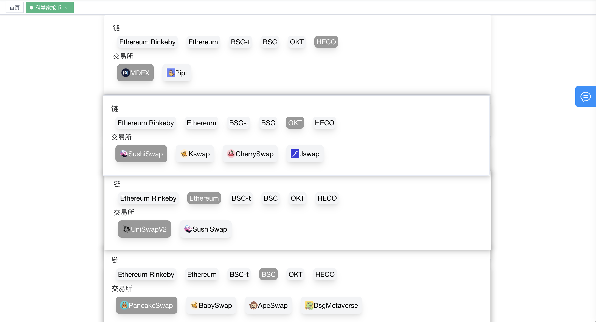
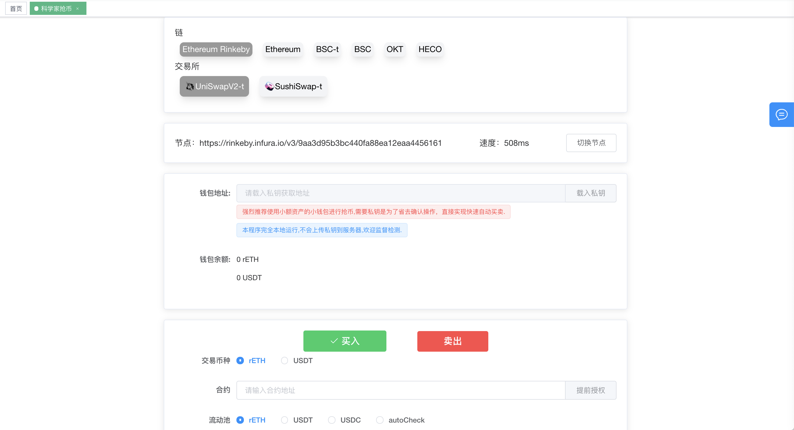
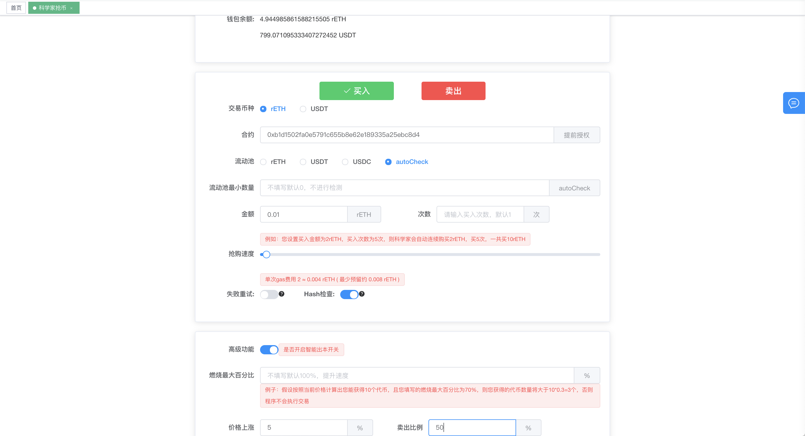
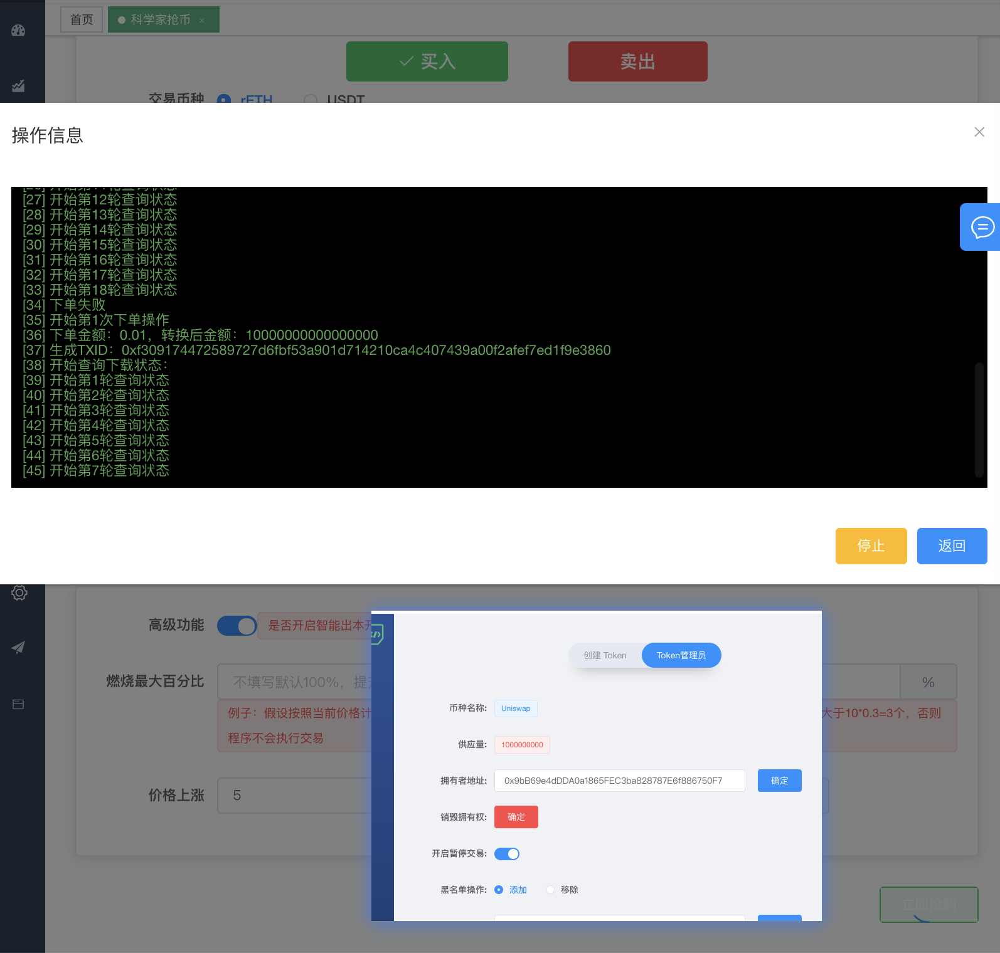
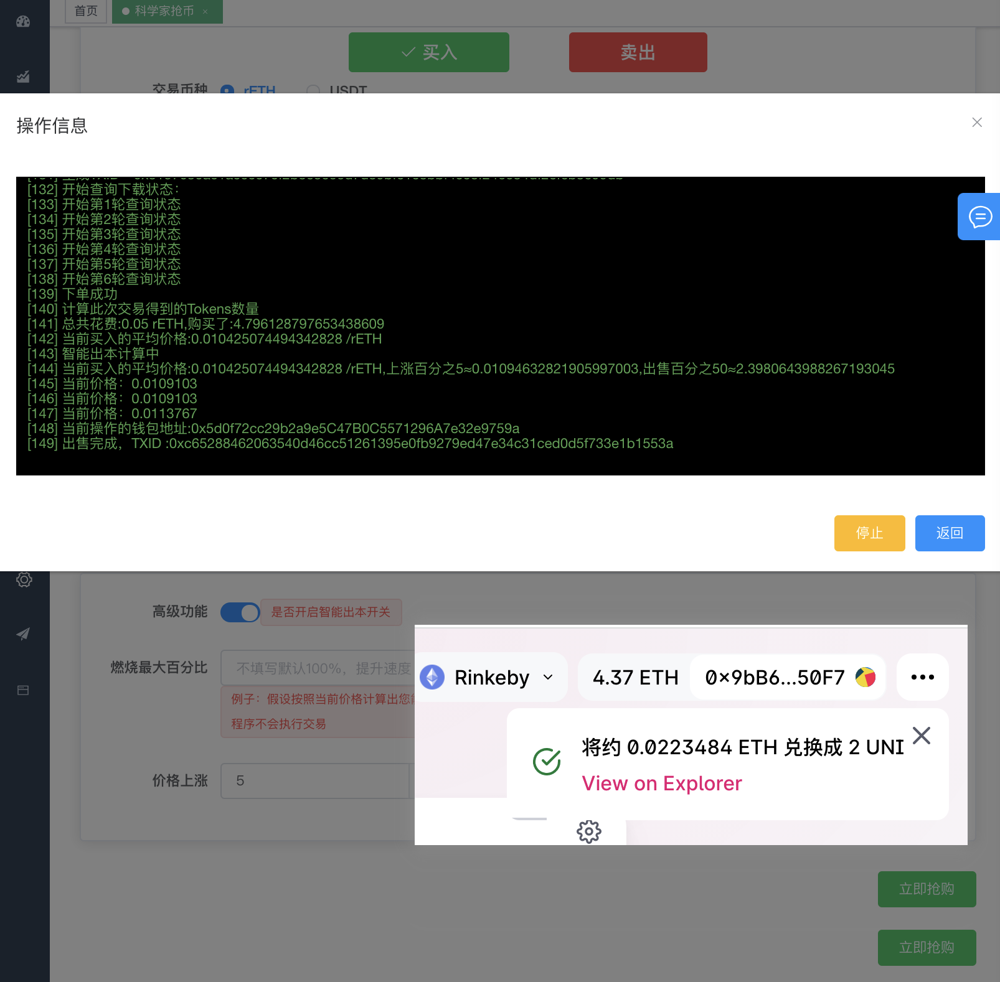
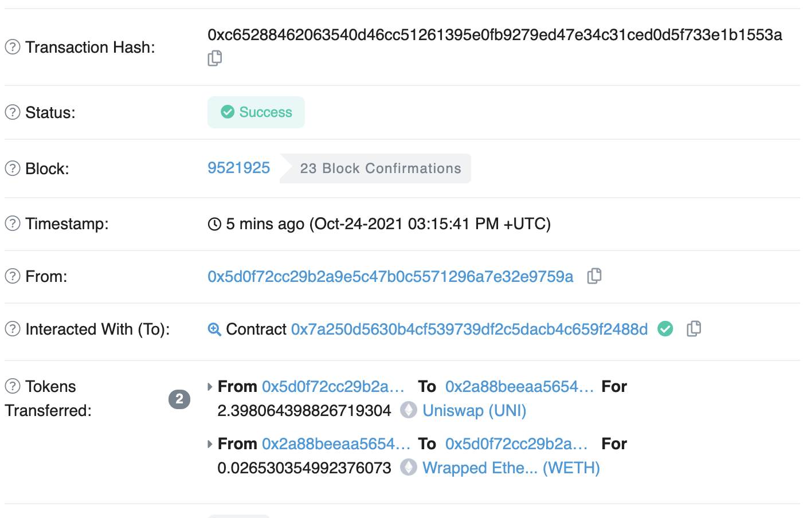

# tokentool.app科学家抢币神器

自从shib火了以后，一级市场就出现了各种动物币，也开始转战一级市场了，一级市场动不动就是几倍几十倍甚至上百倍行情，非常刺激。但是一级市场的币都是没有通过审核的，风险也极大。但是玩一级市场抢新币，需要一个好的工具——抢币科学家。项目一开盘就抢进去，赚取后期的大幅利润。

## **TokenTool.App是什么？**

TokenTool.app本身是一个科学家网站，上面有很多非常牛逼的功能，比如批量创建钱包，批量空投，批量查询，代币归集，钱包授权解除等强大的功能。当然我今天要介绍的不是这些，而是针对一级市场火爆而设计的科学家抢币神器。最重要的是**免费！** **免费！** **免费！** 后期可能会进行收取一点服务器和劳力费用，现在是一直免费。

科学家网页  https://tokentool.app/robotTrade/panicBuying

选择平台，我发现这个科学家抢币神器支持的平台很多，基本上市面上见到的主流的 费主流的都支持，最近还新增加了马蹄链的quickswap等其他平台。

大家根据自己要抢的币的dex 进行选择对应的平台，这里演示，我选择了eth链的Rinkeby 的测试网，选择uniswap 平台进行演示如何抢购。

选择好平台后导入私钥，强烈推荐使用小额资产的小钱包进行抢币,需要私钥是为了省去确认操作，直接实现快速自动买卖.**本程序完全本地运行,不会上传私钥到服务器,欢迎监督检测.**

载入私钥成功后，用户可以看到BNB或者HT或者OKT 余额，具体展示哪一种，和用户选择的交易平台属于哪 个智能链有关。

目前支持用户进行买入和卖出，双向交易

交易币种：使用平台币或者USDT稳定币进行购买

合约地址：则是在uniswap 中可以交易的币，本教程演示的是购买UNI测试币，地址`0xb1d1502fa0e5791c655b8e62e189335a25ebc8d4` 

提前授权：一般钱包里面没有币是不能提前授权的。使用科学家可以给没有的币提前授权，在卖出的时候就不用再次授权了。卖出速度更快，避免错过最佳卖出点位。

流动池：流动池检测当前的币种的交易对是使用那种配置，如UNI-ETH 那么选择ETH，不同币种的交易对不一样，如果不知道是什么交易对，则选择autoCheck 自动检测机制。

流动池最小数量：检测流动池的交易对池子数量，如果小于配置信息，则不会进行下单操作，默认不检查。

购买金额/数量：例如您设置买入金额为2个ETH，买入次数为5次，则科学家会自动连续购买2ETH，买5次，一共买10ETH

失败重试：在购买后进行检测购买是否成功，如失败会一直进行购买，直到购买成功为止。此开关会一直燃烧手续费，需要谨慎小心。

高级功能:自动卖出智能回本（该功能根据买入的币和花费的币计算平均价格，实时计算当前买入的币的价格的涨幅，如超过上涨比例，则进行出售比例。

这个通过token管理员将开启暂停交易开启，则会无法交易，通过开启失败重试功能，将会一直循环下单操作直到成功为止。

此处交易可以看到买入0.01ETH，买入5次，总共花费了得到UNI币的数量，计算出平均价格，为0.010425074494342828 。

通过另外一个钱包地址把UNI的价格拉高，买入了0.0223484个ETH，此时UNI的价格上涨到 0.0113767，触发了智能回本功能，卖出了2.398064398826719304个UNI。

