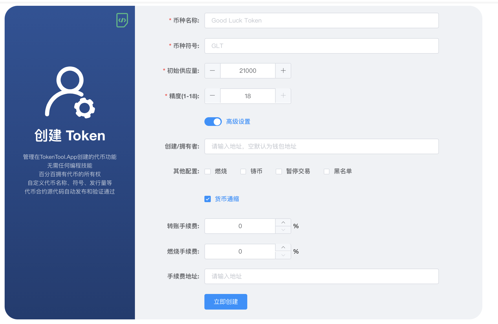
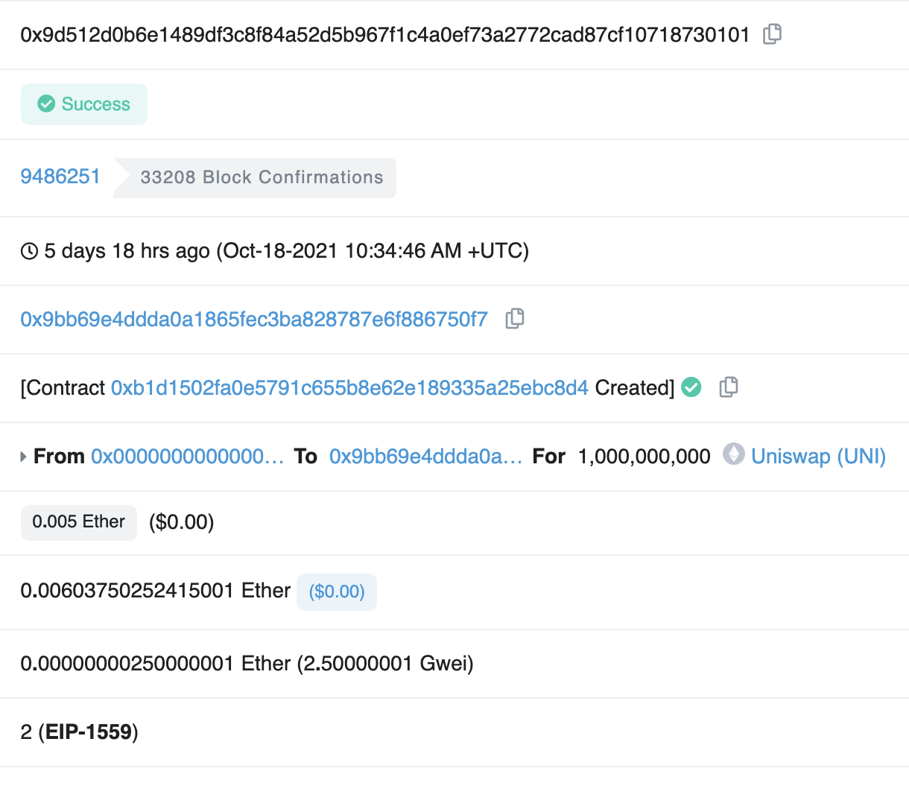
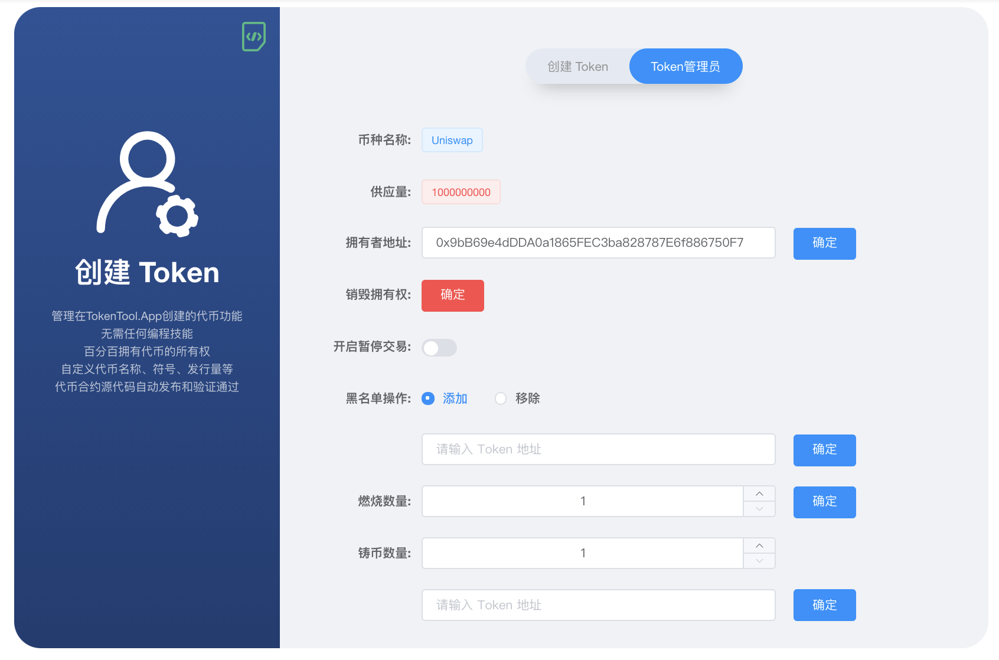
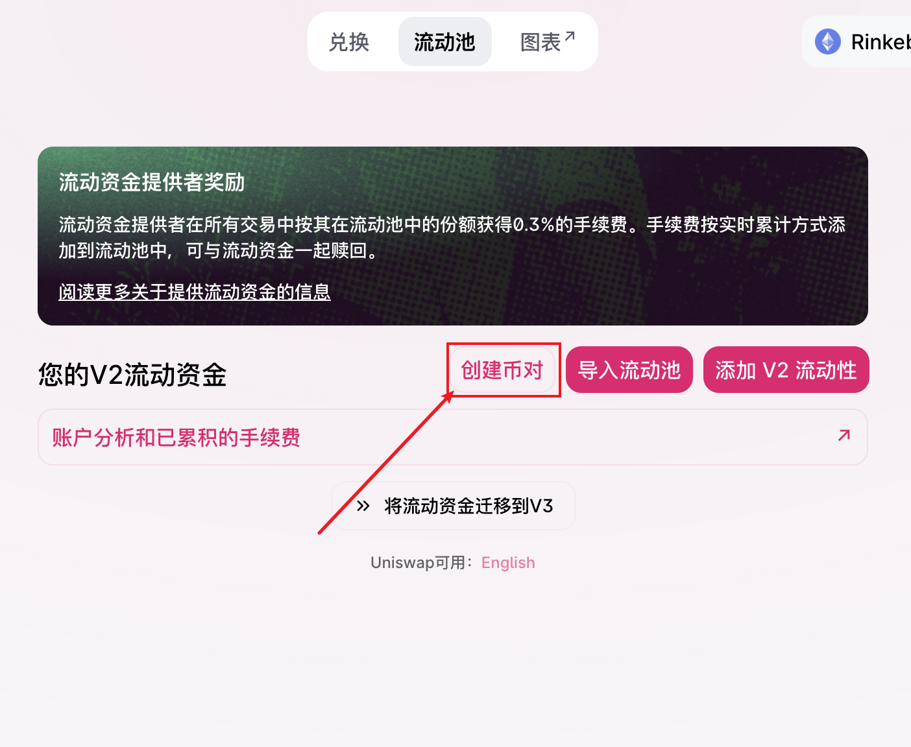
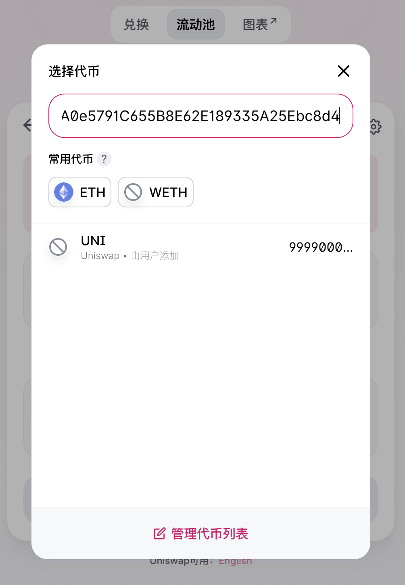
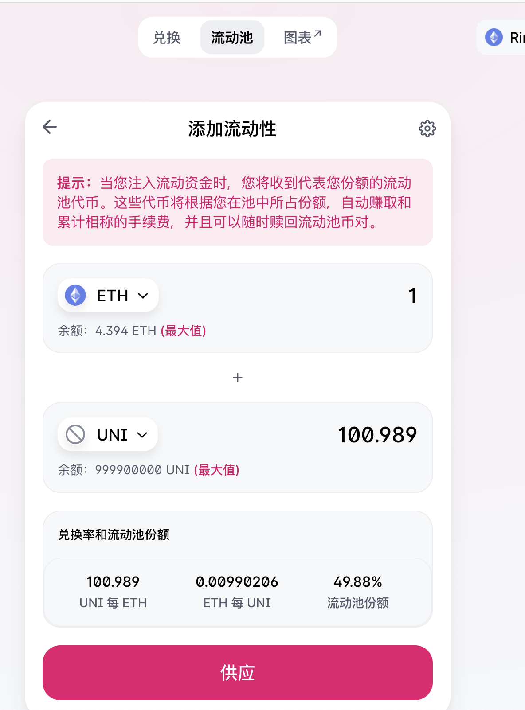

# 轻松创建ERC20代币

如何使用TokenTool 铸造标准代币
[https://www.youtube.com/watch?v=K0PExlXV0LI](https://www.youtube.com/watch?v=K0PExlXV0LI)

## 轻松创建ERC20代币 

https://TokenTool.App 提供了简单的可视化页面化的形式创建标准的ERC20的代币，解决了各种繁琐的安装各种环境的苦恼。如果要自己通过编写solidity合约代码，在通过truffle编辑发布，还需要安装Node.Js，对于没有编程技术的人员来是一个大问题，TokenTool.App 解决了这个问题，通过编译好的字节码，通过Web3 发布自己代币。接下来进入如何发布一个ERC20标准代币。以及在uniswap中添加流动性.本次教程文档使用测试链进行操作.

## 代币基本信息

首先我们通过可视化界面创建代币，通过 [https://www.tokentool.app/createToken/eth](https://www.tokentool.app/createToken/eth) 打开创建代币功能.填写代币信息.

这里模仿创建一个 Uni 的代币信息。

代币名称：Uniswap	，

代币符合：UNI，

初始供应量：1000000000，

精度：18 ，

创建者是否需要转移给别的钱包地址，token代币是否有通缩机制，如果有通缩机制没燃烧比例，以及手续费等信息进行相关的配置，进行创建操作。通过右上角提示，打开区块链浏览器

成功创建了代币，生成了代币的地址：`0xb1d1502fa0e5791c655b8e62e189335a25ebc8d4` ，代币拥有者可通过 `token管理员` 功能进行代币管理

开启暂停交易：如果开启则当前代币无法进行转账操作（包括swap操作）

黑名单添加/移除：通过添加地址，将过滤指定的地址无法参与代币的任何操作，如（科学家地址添加到黑名单中

燃烧数量：缩量缩少代币的流通，将总量打入燃烧地址中。

铸币数量：扩大供应量，铸币需要填写地址，将铸出来的币发送到某个地址中。

## 通过uniswap添加流动性

上面我们将如何通过可视化页面进行一键式的创建token。接下来，如果将创建好的token，进行添加到uniswap中，让更多的用户可以在swap上进行交易买/卖。

第一步打开[https://app.uniswap.org/#/pool/v2](https://app.uniswap.org/#/pool/v2) 打开流动池。

选择创建币对

选择代币，在对话框中输入合约地址，将会出现刚刚创建好的token。选择好后将是对token的价格进行设置。如果是第一次配对者是初始化token的价格。

当前设置的币价是 1个ETH=100.989个 UNI， 那么一个UNI = 0.001989 左右的ETH，这一步骤非常重要，决定UNI的初始化价格。

> 原文链接：[https://docs.tokentool.app/token/create-token](https://docs.tokentool.app/token/create-token)

