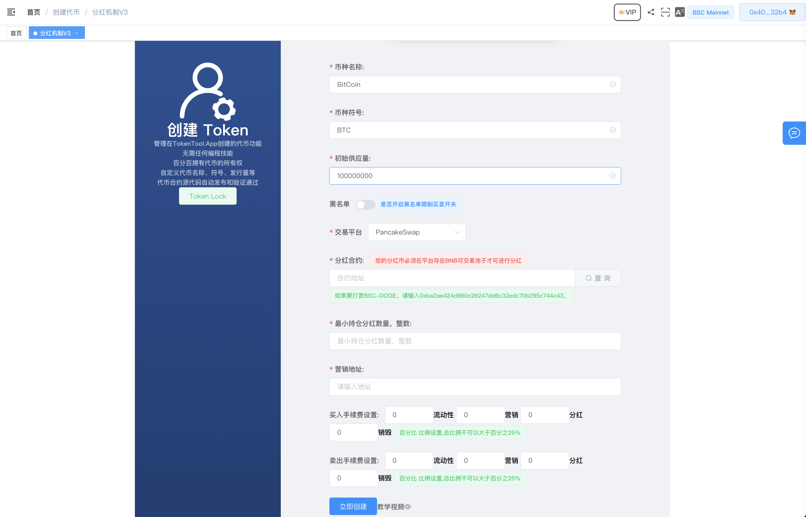
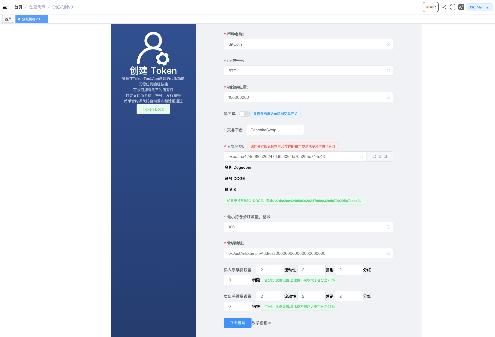

# 创建一个持币分红币

如果在TokenTool 铸造一个带有持币分红机制的代币 ： [https://youtu.be/CePxDWuOyd8](https://youtu.be/CePxDWuOyd8)

查看一下步骤，了解如果使用PC电脑端的Matamask钱包通过TokenTool创建持币分红代币。

1. Matemask钱包链接到区块链网络。
2. 打开创建代币链接地址 [https://tokentool.app/createToken/v3](https://tokentool.app/createToken/v3)
3. 输入必要的信息，在此之前，让我们回顾一下所有需要填写的重要字段：

币种名称：代币的名称信息（如BitCoin）

币种符号：代币的符号信息（如BTC）

初始供应量：代币的总供应量

黑名单：黑名单限制买卖开关（开启后可在管理员页面进行操作添加某些地址无法进行`交易`,`转账`）

交易平台：不同的链会有不同的交易平台（如ETH链有`uniswap`,BSC链有`pancakeSwap` 等）

分红合约：代币奖励合约地址，您要用于奖励用户的代币的合约地址。例如，您在币安智能链上创建一个BitCoin 代币，并想用 DOGE 奖励您的用户，请输入 0xba2ae424d960c26247dd6c32edc70b295c744c43（Binance-Peg 狗狗币合约地址）。

最小持仓分红数量：为了获得奖励，每个钱包必须至少持有这个数量的代币，才有资格参与分红DOGE奖励。

营销钱包：“营销费用（%）”部分的代币将发送到该地址。

流动性 (%)：自动发送到流动性池的每笔交易的代币数量百分比。

营销 (%)：发送到营销地址的每笔交易的代币数量百分比。如果您选择 DOGE 作为奖励代币，营销钱包将收到 DOGE 而不是基础代币。

分红 (%)：每笔交易中分配给所有代币持有者的代币数量的百分比。如果您选择 DOGE 作为奖励代币，您的用户将获得 DOGE 奖励，而不是基础代币。当代币数量大于总供应量的 0.002% 时，奖励费用将自动兑换为奖励代币。

销毁(%)：每笔交易中会根据比例数量进行销毁基础代币，转入到`0x0000000000000000000000000000000000000000` 地址

例如，您使用以下参数创建 BabyDoge1000x 令牌：

代币名称：BitCoin 代币：BTC 总供应量：100000000 BTC 每笔交易产生 6% 的费用，其中：2% 分配给 DOGE 中的所有持有者， 2% 锁定在流动性池中以创造稳定上涨的价格，2% 分配到营销地址：0xJustAnExampleAddress000000000000000000000。

在下图中，您可以看到要在各个字段中输入的信息。

4. 输入所有必要信息后，单击“立即创建”。

5. MetaMask 现在会要求您确认交易。它还将向您显示您需要为该交易支付的费用。如果您同意，请单击“确认”按钮以完成该过程。
