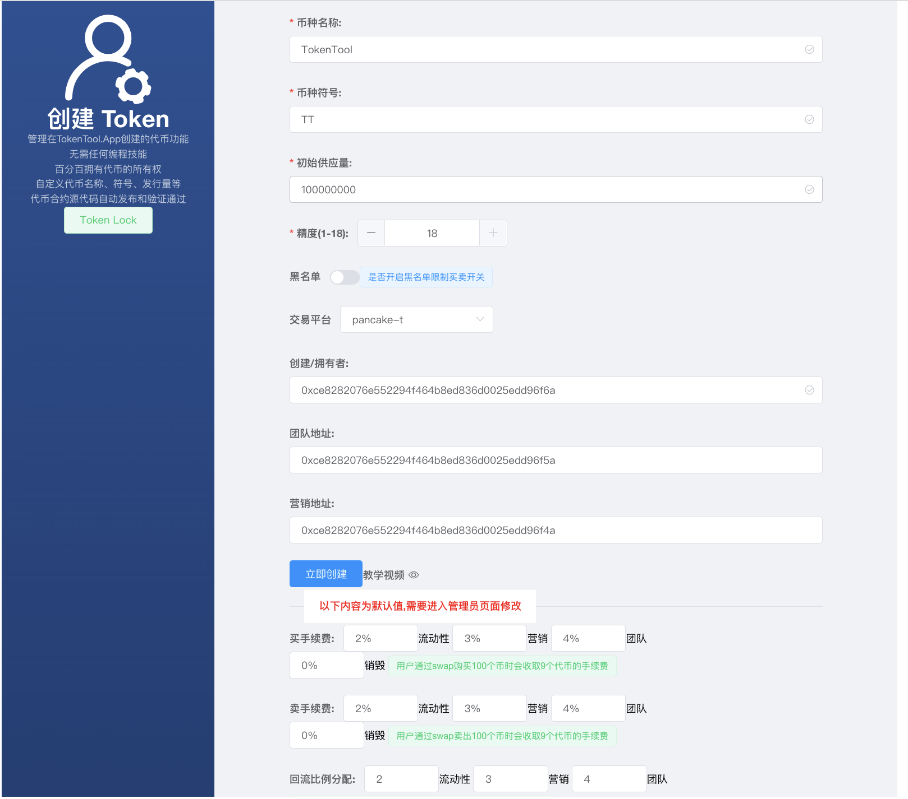
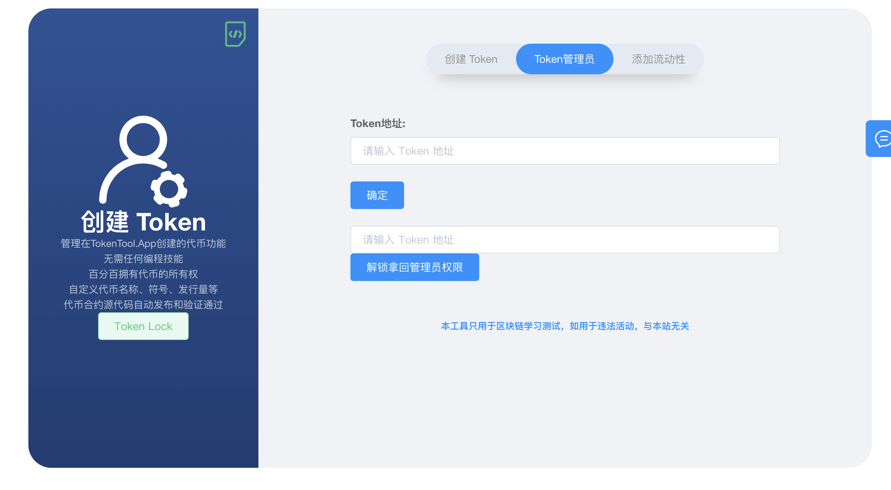
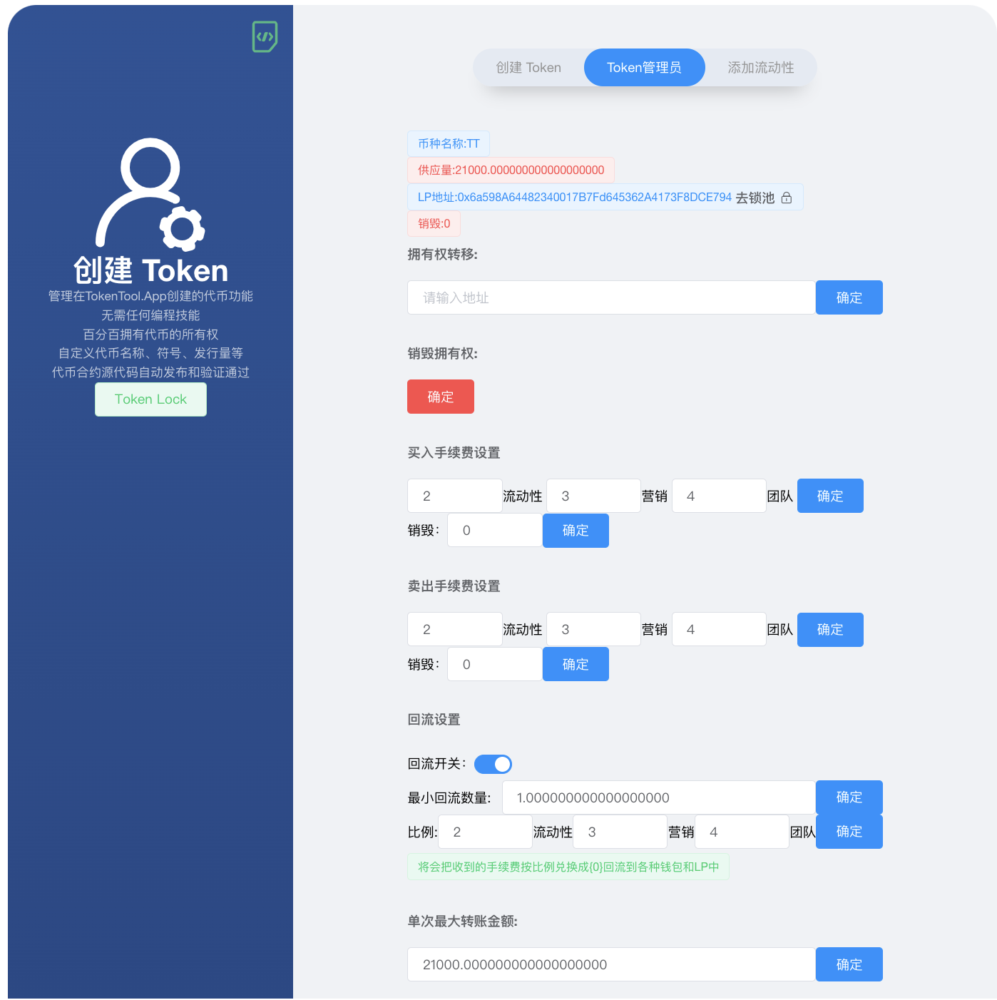
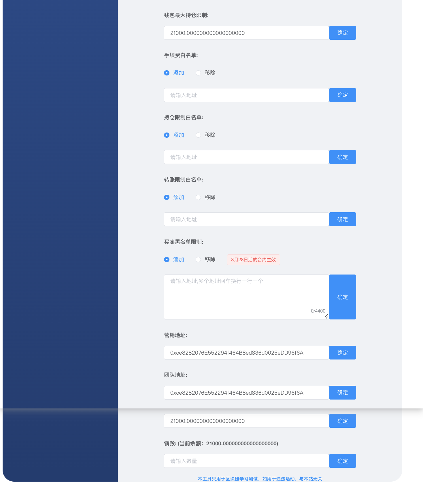

# 创建带有买卖费率令牌

如何使用TokenTool 铸造带手续费机制代币
[https://youtu.be/zPVY_oZH5qo](https://youtu.be/zPVY_oZH5qo)

## 轻松创建ERC20代币

https://TokenTool.App 提供了简单的可视化页面化的形式创建ERC20的代币，解决了各种繁琐的安装各种环境的苦恼。如果要自己通过编写solidity合约代码，在通过truffle编辑发布，还需要安装Node.Js，对于没有编程技术的人员来是一个大问题，TokenTool.App 解决了这个问题，通过编译好的字节码，通过Web3 发布自己代币。接下来进入如何发布一个ERC20代币。以及在pancake中添加流动性.本次教程文档使用测试链进行操作.

## 创建一个带有买卖费率令牌

查看以下步骤，了解如何使用 MetaMask 通过 TokenTool 创建带有买卖费率令牌币。

1. 首先我们通过可视化界面创建代币，通过 https://www.tokentool.app/createToken/v2 打开创建代币功能.填写代币信息.

2. 参数介绍说明

币种名称：代币的名称信息（如BitCoin）

币种符号：代币的符号信息（如BTC）

初始供应量：代币的总供应量（精度18位时，总供应量可以1后面15个0，精度17位时，总供应量可以1后面16个0，以此类推..）

精度：代币的精度位数（精度是代表币的小数位数`如：0.000001`代表有6为精度）

黑名单：黑名单限制买卖开关（开启后可在管理员页面进行操作添加某些地址无法进行`交易`,`转账`）

交易平台：不同的链会有不同的交易平台（如ETH链有`uniswap`,BSC链有`pancakeSwap` 等）

创建/拥有者：此代币的创建/拥有者，owner管理员，只有管理员才能进如管理员后台去修改手续费参数等操作

团队地址：根据手续费比例分配给团队的地址的费用

营销地址：根据手续费比例分配给营销的地址的费用（类似2个营销地址，如果没有可以填写一样）

买手续费：用户通过swap进行购买时收取的手续费费用（**以下手续费为默认值，如果需要修改可进入管理员页面修改比例**）

卖手续费：用户通过swap进行卖出时收取的手续费费用（**以下手续费为默认值，如果需要修改可进入管理员页面修改比例**）

回流比例分配：（根据收取到的手续费进行二次分配）

​		流动性：手续费占比添加到流动性中。

​		营销：手续费占比兑换成BNB回流到营销地址中

​		团队：手续费占比兑换成BNB回流到团队地址中

## Token管理员

查看以下步骤，了解如何使用 MetaMask 通过 TokenTool 进入Token管理员页面。

1. 管理员钱包链接MetaMask 钱包链接
2. 在Token管理员页面中输入代币的合约地址进入管理员页面

1. 拥有权转移：可以将来owner权限转移给第三者 或者 其他地址
2. 销毁权限：将owner地址转移给 `0x0000000000000000000000000000000000000000`地址
3. 买卖手续费：可编辑修改你的交易手续费（手续费在swap交易时收取，转账不会收取手续费）
4. 回流开关：用户在swap收取到的手续费将会存在当前合约中，达到了`最小回流数量` 触发回流机制
5. 回流比例：根据回流的比例，回流到各个位置
   1. 流动性代表进入池子中
   2. 营销代表转入营销地址
   3. 团队代表转入团队地址
6. 单次最大转账金额：限购/转账 限制（普通用户在买卖/转账时不可超过单次最大转账数量）

1. 钱包最大持仓限制：一个地址的数量不可超过（钱包最大持仓限制量）

2. 手续费白名单：可将固定地址添加到白名单中，使其在进行交易时免手续费，单次只能添加一个地址，可多次添加地址无上限

3. 持仓限制白名单：如设置了持仓限制将会对所有的地址进行限制钱包的最大数量，如要解除限制，将可加入白名单

4. 转账限制白名单：如设置了转账限制用户将在交易时受到限制，如加入白名单将不会收到限制

5. 黑名单限制：用户用户地址添加到黑名单中时，用户将无法 `转账` `交易` 操作 

6. 营销/团队地址：可二次编辑修改地址

7. 最大销毁数量：如币种在交易时有销毁机制，可设置销毁多大数量时不在进行销毁

8. 销毁金额：将您钱包中的余额转入到黑洞地址`0x000000000000000000000000000000000000dEaD`

   

> 原文链接：[https://docs.tokentool.app/learn/create-token](https://github.com/TokenTool-App/tokentool-docs/blob/main/learn/create-token.md)
> 
> 引用地址
> [https://www.tokentool.app/createToken/v2](https://www.tokentool.app/createToken/v2) 创建代币地址
> [https://youtu.be/zPVY_oZH5qo](https://youtu.be/zPVY_oZH5qo) 油管教学视频
